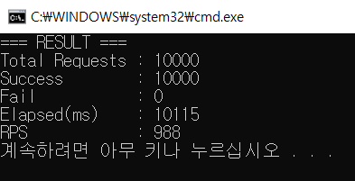
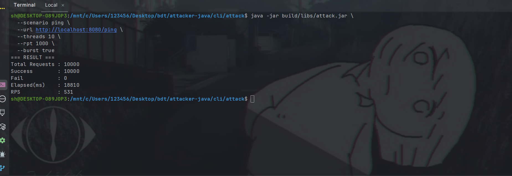
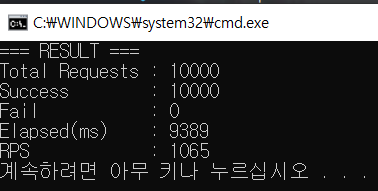
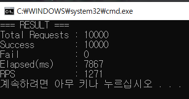
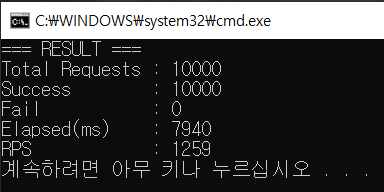
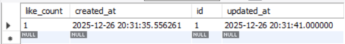
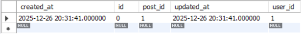

<details>
<summary>ch01: ping-test</summary>

## 1. 개요

**Rate Limiter가 없는 서버 환경**에서, 매우 가벼운 REST API(`GET /ping`)에 대해 **Java SE 기반 공격(부하) CLI**를 사용하여 동시 요청을 발생시키고 문제가 발생하는지 확인

---

## 2. Server 구성

### 2.1 Filter Chain

### CustomFilterChain

- **HttpLoggingFilter & ResponseWrapper**
    - HTTP 요청/응답을 로깅하기 위한 필터
    - 실험 시 로깅으로 인한 오버헤드를 제거하기 위해 비활성화
    - `@ConditionalOnProperty` 기반으로 on/off 제어
- **CorsFilter**
    - Local 환경(IPv4, IPv6)에서 허용된 요청만 통과
    - 그 외 접근은 차단

---

### 2.2 Endpoint

### PingController

- 비즈니스 로직이 없는 단일 REST API Endpoint
- 요청
    
    ```bash
    curl -X GET http://localhost:8080/ping
    ```
    
- 응답
    
    ```
    pong
    ```
    

---

## 3. attack-cli 구성

### 3.1 기술 스택

- Java 21 (SE)
- Gradle Wrapper (`gradlew`)
- `java.net.http.HttpClient` 기반 구현

---

### 3.2 cli-module

- **AttackConfig**
    - 공격에 사용될 변수가 담기는 불변 객체(record)
- **cliParser**
    - cli script를 파싱하여 AttackConfig로 변환
- **AttackScenario**
    - 공격 방식을 정의할 인터페이스, 구현체로 PingScenario 사용
- **PingScenario**
    - Ping 공격에 사용될 HttpRequest를 구성하고 반환
- **ScenarioRequestResolver**
    - Scenario를 해석하고 올바른 HttpRequest로 변환
- **AttackRunner**
    - HttpClient를 구성하고 HttpRequest 전송 (latch, platform thread, thread pool)
    - 실행 결과 로깅
- **Main**
    - cli에서 전달받은 args를 올바른 모듈에 전달
    
    ---
    

### 3.3 config 구성

```java
public record AttackConfig(
    String url,
    int threads,              // 동시에 실행될 워커 스레드 수
    int requestsPerThread,    // 단일 스레드가 보내는 요청 수
    boolean burst,            // burst 모드 여부
    String scenario            // 공격 시나리오명 (예: ping)
) {}

```

- **threads**: 병렬로 실행되는 플랫폼 스레드 수
- **requestsPerThread**: 각 스레드가 수행할 요청 횟수
- **burst**:
    - `false`: 모든 스레드가 준비된 뒤 동시에 요청 시작
    - `true`: 준비 대기 없이 즉시 요청을 발사
- **scenario**: CLI 실행 시 선택되는 공격 시나리오

---

## 4. 실행 스크립트 예시

### 4.1 Build

```java
cd attacker-java/cli/attack
./gradlew clean jar
```

### 4.2.1 Linux / WSL / Bash

```bash
java -jar build/libs/attack.jar \
  --scenario ping \
  --url http://localhost:8080/ping \
  --threads 10 \
  --rpt 1000 \
  --burst true
```

---

### 4.2.2 Windows (PowerShell / CMD)

```bash
java -jar build/libs/attack.jar ^
  --scenario ping ^
  --url http://localhost:8080/ping ^
  --threads 10 ^
  --rpt 1000 ^
  --burst true
```

---

## 5. 실행 방식 상세

### 5.1 burst = false (Non-Burst Mode)

1. `threads` 개수만큼 플랫폼 스레드를 생성
2. 각 스레드를 스레드 풀에 적재
3. 동시에 `CountDownLatch`의 카운트를 감소
4. 모든 스레드가 준비되어 latch가 `0`이 되면
5. 각 스레드가 `requestsPerThread` 만큼 요청 전송

> 모든 스레드가 동일한 시점에서 시작

---

### 5.2 burst = true (Burst Mode)

1. `threads` 개수만큼 플랫폼 스레드를 생성
2. 스레드 적재와 동시에 대기 없이 요청 전송
3. 각 스레드는 `requestsPerThread` 만큼 즉시 요청 수행
4. 전체 과정을 **10ms delay** 후 반복

>

---

## 6. 배치 파일 (in /scripts dir)

- **ping_10000req.bat**
    - burst = false
    - 10개 스레드 × 1000 요청
    - 동시 시작을 보장하는 실험
- **ping_10000req_burst.bat**
    - burst = true
    - 동일한 요청 수
    - 최대한 빠르게 요청을 몰아서 전송

---

## 7. 집계

```java
AtomicInteger success = new AtomicInteger(); // thread-safe한 카운트
AtomicInteger fail = new AtomicInteger();
```

- Success
    - HTTP Status `200` 응답 수
- Fail
    - `200`이 아닌 모든 응답 수
- Elapsed(ms) : `end - start (currentTimeMillis)`
- Total Requests: `threads × requestsPerThread`
- RPS(Requests Per Second): `totalRequets / (elapsed(ms) / 1000)`

---

## 8. 실행 결과 예시

### **ping_10000req.bat**



### **wsl (ubuntu, intellij terminal)**



---

## 9. 인사이트

rate limiter가 없는 환경에서도 단순하지만 많은 요청을 실패없이 처리했다. 이는 요청 수보다 단일 요청이 유발하는 비용의 크기가 더 큰 영향을 미친다는 점을 시사했다. 그럼에도, 비정상적으로 반복되고 많은 요청에도 서버가 아무런 제한을 하지않는 상태임을 확인할 수 있었다.

현재로써는 rate limiter의 당위성이 부족하기 때문에, 먼저 고비용 작업(network I/O, DB wrihte) API를 구성하는 방향으로 확장한다.
</details>
간단한 동작을 수행하는 엔드포인트에 1만번의 요청 공격을 보냅니다. 장애가 없음을 확인하고 서버 로직을 비용이 큰 작업(db-write)으로 확장합니다.

</br>
<details>
<summary>ch02: db-write attack</summary>
## 실험 환경

- **DB**: MySQL 8.0 (InnoDB)
  - `isolation level = REPEATABLE_READ (default)`
  - `auto commit = true (default)` (단, @Transactional 진입 시 트랜잭션 시작과 함께 autoCommit=false로 설정됨)
- **ORM**: Spring Data JPA (with Hibernate, ConnectorJ)
- **Connection Pool**: HikariCP
  - `maximumPoolSize = 10 (default)`
  - `connectionTimeout = 30000ms (default)`
---

## 실험 시나리오 (CLI 공격)

CLI를 사용해 다음과 같은 공격 시나리오를 실행

- 대상 게시물: `postId = 1`
- 요청 사용자: `userId = 1`
- 총 요청 수: **10,000건**
- 실행 방식:
  - **10개의 플랫폼 스레드**
  - 각 스레드당 **1,000개의 요청**을 worker 큐에 적재
  - `CountDownLatch`가 0이 되는 순간 **동시에 실행**

의도적으로 *동일 userId + 동일 postId* 요청을 동시에 발생시켜, 일반적인 웹 환경에서는 잘 드러나지 않는 문제 상황을 재현

---

## 실험 결과 요약

- **최초 두 개의 트랜잭션만으로 Deadlock 발생**
- 이후 트랜잭션들은 커넥션을 점유한 채 대기
- 일부 요청은 커넥션을 할당받지 못하고 timeout

### CLI 결과

```text
Total Requests : 10000
Success        : 9991
Fail           : 9
Elapsed(ms)    : 49708
RPS            : 201
```

---
### Post Entity

```java
@Entity
@Table(name = "post")
public class Post extends BaseTime {

  @Id @GeneratedValue
  private Long id;

  private int likeCount;

  public void increaseLike() {
    this.likeCount++;
  }
}
```

- 게시물 엔티티
- `likeCount`는 트랜잭션 내에서 증가

---

### PostLike Entity

```java
@Entity
@Table(
  name = "post_like",
  uniqueConstraints = @UniqueConstraint(columnNames = {"post_id", "user_id"})
)
public class PostLike extends BaseTime {

  @Id @GeneratedValue
  private Long id;

  @ManyToOne(fetch = FetchType.LAZY)
  private Post post;

  private Long userId;
}
```

- 게시물과 사용자 간의 좋아요 관계
- `(post_id, user_id)` 조합에 **유니크 제약조건** 적용
  - 한 사용자는 하나의 게시물에 한 번만 Like 가능

---
### LikeService

```java
@Service
@RequiredArgsConstructor
public class LikeService {

  private final PostRepository postRepository;
  private final PostLikeRepository postLikeRepository;

  @Transactional
  public void like(LikeRequest request) {

    Post post = postRepository.findById(request.postId())
        .orElseThrow();

    if (postLikeRepository
        .existsByPostIdAndUserId(request.postId(), request.userId())) {
      return;
    }

    postLikeRepository.save(new PostLike(post, request.userId()));
    post.increaseLike();
  }
}
```

- 하나의 트랜잭션 안에서 **조회 → 존재 확인 → 삽입 → 업데이트**를 모두 수행
- 동시다발적 요청이 없는 경우에만 적합한 코드(이하 후술)

---
### Cli Request (in attacker-java dir)
```java
// ch02: DB-Write baseline
public class LikeScenario implements AttackScenario {

  AttackConfig config;

  public LikeScenario(AttackConfig config) {
    this.config = config;
  }

  @Override
  public HttpRequest toRequest() {

    String body = """
        { "postId": 1,
         "userId": 1}
        """;

    return HttpRequest.newBuilder()
        .uri(URI.create(config.url()))
        .header("Content-Type", "application/json")
        .POST(HttpRequest.BodyPublishers.ofString(body))
        .build();
  }
}
```

- postId=1인 게시물에 userId=1로 Like 요청, InnoDB의 유니크 제약조건 검증 유도
  - 한 사용자는 하나의 게시물에 한 번만 Like 가능

---
### like_10000req.bat (in attacker-java dir)
```powershell
@echo off
cd /d "%~dp0.."
call scripts\common.bat

java -jar %JAR_PATH% ^
  --scenario like ^
  --url %BASE_URL%/post/like ^
  --threads 10 ^
  --rpt 1000 ^
  --burst false

pause
```
- 10개의 thread에서 각 1000번의 req 전송(Java Platform Thread, CountDownLatch 기반)
- 비정상적(동일 Id에 대한 동시다발적)요청으로 InnoDB lock 결함 유도
- 유니크 제약 조건 처리를 위해 **InnoDB는 내부적으로 lock을 사용**(select .. for update 등이 아니어도)
- 초기 2개의 요청만으로 **deadlock** 발생
---

## 데드락 원인

```
T1: post S-lock 보유  → post_like S-lock 대기
T2: post_like X-lock → post X-lock 대기

→ 순환 대기 발생
→ InnoDB가 T1을 롤백
```

<details>
<summary>개념 상세</summary>

1. T1은 post 레코드에 s-lock을 걸었다.
```text
index PRIMARY of table `bdt`.`post`
trx id 479984 lock mode S locks rec but not gap
```
단순 select 문에는 s-lock이 걸리지 않는다. 그럼에도 t1은 post 조회 시점에 s-lock을 걸었다.
이후 쿼리에서 lickCnt를 update하기 때문에 미리 걸어놓은 것일까? 아니다. InnoDB는 미래의 동작을 예측하지 않는다.
이유는, 유니크 제약조건이 걸려있기 때문이다. reapeatable read 격리 수준에서는 트랜잭션의 버전관리를 통해 일관성있는 읽기를 제공한다.
하지만, 유니크 제약조건에서 필요한 것은 과거의 스냅샷이 아닌 현재 레코드의 상태이다.

가령, t1과 t2 조회시점에 모두 레코드가 존재하지 않는 상태였고 이후 t1, t2에서 insert를 진행한다면 중복된 쓰기가 발생한다.
이는 t1과 t2 조회에서는 일관성있는 읽기가 보장되었지만, 결과적으로 유니크 제약조건을 위배한다.

때문에, t1 조회 시점에서 s-lock을 걸어 t2가 x-lock을 획득하지 못하게 해야한다. 이런 이유로 select문이 for update 등이 아니여도 innoDB는 무조건 s-lock을 걸게된다.

2. T2는 post_like 레코드에 x-lock을 걸었다.
```text
index UKpmmko3h7yonaqhy5gxvnmdeue of table `bdt`.`post_like`
trx id 479983 lock_mode X locks rec but not gap
```
요청이 동시에 발생했기 때문에 순서는 보장되지 않는다. 여기서는 T1의 트랜잭션이 마무리 되기 이전에 T2이 시작된다.
select가 아닌 update(increase likeCnt)가 이뤄져야 하기 때문에 x-lock을 점유한다.
특이사항으로는 T2의 tid가 더 작은(먼저 생성된) 값임을 확인할 수 있다. 이 역시 T2가 먼저 시작되었지만 순서가 보장되지 않았음을 의미한다.

3. T2는 post 레코드에 x-lock을 걸려고 기다린다.
```text
index PRIMARY of table `bdt`.`post`
trx id 479983 lock_mode X locks rec but not gap **waiting**
```
하지만, t1이 post의 s-lock을 선점한 상태이기 때문에 waiting한다.
(만약 s-lock을 걸려 했다면 s-lock은 공유가 가능하므로 기다리지 않는다. 하지만, x-lock을 걸려고하며 이는 t1이 s-lock을 쥐고있을 때 불가하다)

4. T1은 post_like 레코드에 s-lock을 걸려고 기다린다.
```text
index UKpmmko3h7yonaqhy5gxvnmdeue of table `bdt`.`post_like`
trx id 479984 lock mode S **waiting**
```
하지만, t2가 post_like x-lock을 선점한 상태이기 때문에 waiting한다.
(t2가 x-lock을 쥐고있을 때 t1이 s-lock을 거는 것 또한 불가하다)

=> 두 트랜잭션이 서로를 무한정 기다리며 데드락이 발생한다.

</details>
<details>
<summary>만약, 유니크 조건이 없었다면?</summary>
현재 서비스 로직은 Check-Then-Act 패턴을 취하고있다. (if exists, then return)
현재 실험은 유니크 조건이 걸려있기 때문에 데이터는 1개만 insert 되었다. (데드락이 발생할 지언정)
만약, 유니크 조건이 없었다면 서버의 exist 체크로는 db-write가 발생하는 시점의 정확한 스냅샷을 제공하지 못한다.
exists=false인 짧은 시간안에 요청이 모두 db로 접근하게되고, 그만큼의 중복 데이터가 생겨 일관성이 무너진다.
</details>
<details>
<summary>InnoDB 로그 상세</summary>

```text
-- Query: SHOW ENGINE INNODB STATUS;
-- Pretty Printed
ENGINE: InnoDB

=====================================
2025-12-18 18:27:12 0x3ccc
INNODB MONITOR OUTPUT
=====================================
Per second averages calculated from the last 32 seconds


-----------------
BACKGROUND THREAD
-----------------
srv_master_thread loops:
  26 srv_active
   0 srv_shutdown
1863 srv_idle

srv_master_thread log flush and writes: 0


----------
SEMAPHORES
----------
OS WAIT ARRAY INFO:
  reservation count 1081
  signal count      1054

RW-shared spins 0, rounds 0, OS waits 0
RW-excl   spins 0, rounds 0, OS waits 0
RW-sx     spins 0, rounds 0, OS waits 0

Spin rounds per wait:
  0.00 RW-shared
  0.00 RW-excl
  0.00 RW-sx


------------------------
LATEST DETECTED DEADLOCK
------------------------
2025-12-18 18:09:15 0x3d7c


*** (1) TRANSACTION:
TRANSACTION 479984, ACTIVE 30 sec inserting
mysql tables in use 1, locked 1
LOCK WAIT 4 lock struct(s), heap size 1128, 2 row lock(s), undo log entries 1
MySQL thread id 62, OS thread handle 17320, query id 51157
localhost 127.0.0.1 sh update

SQL:
insert into post_like
(created_at, post_id, updated_at, user_id, id)
values
('2025-12-18 18:09:15.35154', 1, '2025-12-18 18:09:15.35154', 1, 2)


*** (1) HOLDS THE LOCK(S):
RECORD LOCKS space id 2625 page no 4 n bits 72
index PRIMARY of table `bdt`.`post`
trx id 479984 lock mode S locks rec but not gap

Record lock, heap no 2
PHYSICAL RECORD: n_fields 6; compact format; info bits 0
 0: len 8; hex 8000000000000001
 1: len 6; hex 0000000752ea
 2: len 7; hex 81000001070110
 3: len 4; hex 80000000
 4: len 8; hex 99b86522290336b7
 5: len 8; hex 99b86522290336b7


*** (1) WAITING FOR THIS LOCK TO BE GRANTED:
RECORD LOCKS space id 2629 page no 5 n bits 72
index UKpmmko3h7yonaqhy5gxvnmdeue of table `bdt`.`post_like`
trx id 479984 lock mode S waiting

Record lock, heap no 2
PHYSICAL RECORD: n_fields 3; compact format; info bits 0
 0: len 8; hex 8000000000000001
 1: len 8; hex 8000000000000001
 2: len 8; hex 8000000000000001


*** (2) TRANSACTION:
TRANSACTION 479983, ACTIVE 30 sec starting index read
mysql tables in use 1, locked 1
LOCK WAIT 6 lock struct(s), heap size 1128, 3 row lock(s), undo log entries 1
MySQL thread id 60, OS thread handle 17172, query id 51159
localhost 127.0.0.1 sh updating

SQL:
update post
set like_count = 1,
    updated_at = '2025-12-18 18:09:15.352537'
where id = 1


*** (2) HOLDS THE LOCK(S):
RECORD LOCKS space id 2629 page no 5 n bits 72
index UKpmmko3h7yonaqhy5gxvnmdeue of table `bdt`.`post_like`
trx id 479983 lock_mode X locks rec but not gap

Record lock, heap no 2
PHYSICAL RECORD: n_fields 3; compact format; info bits 0
 0: len 8; hex 8000000000000001
 1: len 8; hex 8000000000000001
 2: len 8; hex 8000000000000001


*** (2) WAITING FOR THIS LOCK TO BE GRANTED:
RECORD LOCKS space id 2625 page no 4 n bits 72
index PRIMARY of table `bdt`.`post`
trx id 479983 lock_mode X locks rec but not gap waiting

Record lock, heap no 2
PHYSICAL RECORD: n_fields 6; compact format; info bits 0
 0: len 8; hex 8000000000000001
 1: len 6; hex 0000000752ea
 2: len 7; hex 81000001070110
 3: len 4; hex 80000000
 4: len 8; hex 99b86522290336b7
 5: len 8; hex 99b86522290336b7


*** WE ROLL BACK TRANSACTION (1)


------------
TRANSACTIONS
------------
Trx id counter 480001
Purge done for trx's n:o < 479999 undo n:o < 0
state: running but idle
History list length 0


LIST OF TRANSACTIONS FOR EACH SESSION:
---TRANSACTION 283709979839384, not started
0 lock struct(s), heap size 1128, 0 row lock(s)

---TRANSACTION 283709979838608, not started
0 lock struct(s), heap size 1128, 0 row lock(s)

---TRANSACTION 283709979837832, not started
0 lock struct(s), heap size 1128, 0 row lock(s)

---TRANSACTION 283709979837056, not started
0 lock struct(s), heap size 1128, 0 row lock(s)

---TRANSACTION 283709979836280, not started
0 lock struct(s), heap size 1128, 0 row lock(s)

---TRANSACTION 283709979835504, not started
0 lock struct(s), heap size 1128, 0 row lock(s)

---TRANSACTION 283709979834728, not started
0 lock struct(s), heap size 1128, 0 row lock(s)

---TRANSACTION 283709979833952, not started
0 lock struct(s), heap size 1128, 0 row lock(s)

---TRANSACTION 283709979833176, not started
0 lock struct(s), heap size 1128, 0 row lock(s)

---TRANSACTION 283709979832400, not started
0 lock struct(s), heap size 1128, 0 row lock(s)

---TRANSACTION 283709979825416, not started
0 lock struct(s), heap size 1128, 0 row lock(s)

---TRANSACTION 283709979824640, not started
0 lock struct(s), heap size 1128, 0 row lock(s)

---TRANSACTION 283709979823864, not started
0 lock struct(s), heap size 1128, 0 row lock(s)

---TRANSACTION 283709979823088, not started
0 lock struct(s), heap size 1128, 0 row lock(s)


--------
FILE I/O
--------
I/O thread 0 state: wait Windows aio (insert buffer thread)
I/O thread 1 state: wait Windows aio (read thread)
I/O thread 2 state: wait Windows aio (read thread)
I/O thread 3 state: wait Windows aio (read thread)
I/O thread 4 state: wait Windows aio (read thread)
I/O thread 5 state: wait Windows aio (write thread)
I/O thread 6 state: wait Windows aio (write thread)
I/O thread 7 state: wait Windows aio (write thread)
I/O thread 8 state: wait Windows aio (write thread)

Pending normal aio reads:  [0, 0, 0, 0]
Pending normal aio writes: [0, 0, 0, 0]

Pending flushes:
  log: 0
  buffer pool: 0

OS file reads  : 1213
OS file writes : 2894
OS file fsyncs : 1403


-------------------------------------
INSERT BUFFER AND ADAPTIVE HASH INDEX
-------------------------------------
Ibuf: size 1, free list len 0, seg size 2, 0 merges

Hash table size 34679


---
LOG
---
Log sequence number          7927516281
Log buffer assigned up to    7927516281
Log buffer completed up to   7927516281
Log written up to            7927516281
Log flushed up to            7927516281
Last checkpoint at           7927516281


----------------------
BUFFER POOL AND MEMORY
----------------------
Buffer pool size        8191
Free buffers            6753
Database pages          1429
Old database pages       507
Modified db pages         0


--------------
ROW OPERATIONS
--------------
Number of rows inserted 62
Number of rows updated  10
Number of rows deleted   0
Number of rows read  40059


============================
END OF INNODB MONITOR OUTPUT
============================

```

</details>

---

## 장애 전파 과정

### 1. t1 <-> t2 race condition 발생, innoDB가 dead lock을 감지하여 t1 rollback

InnoDB 판단

```text
// db
*** WE ROLL BACK TRANSACTION (1)
```

- 순환 대기(deadlock)를 감지
- 비용이 낮다고 판단한 `Transaction 1`을 롤백

---

### 2. 연쇄 효과: 커넥션 풀 고갈
- t1의 희생(롤백)으로 인해 t2만 수행되며 데드락이 해제되었음
- 이후 트랜잭션은 pool을 점유한 채 대기하다가 T1 rollback 이후 정상 수행
- t3, t4.. 부터는 duplicate key 예외 발생 (정상적으로 unieque constraints를 적용받는 중)
- 이후 9991개의 트랜잭션이 처리되었음
```text
// server
java.sql.SQLIntegrityConstraintViolationException: Duplicate entry '1-1' for key 'post_like.UKpmmko3h7yonaqhy5gxvnmdeue' // 의도된 예외
```

### 3. 연쇄 효과: deadlock 처리 동안 지연되며 일부 트랜잭션은 타임아웃 발생
- 30초의 타임아웃 동안 connection pool 할당(waiting 상태 돌입)조차 받지 못한 트랜잭션은 요청 자체가 실패됨

```text
// server
java.sql.SQLTransientConnectionException:
HikariPool-1 - Connection is not available,
request timed out after 30002ms
(total=10, active=10, idle=0)

// db
LIST OF TRANSACTIONS FOR EACH SESSION:
---TRANSACTION 283709979839384, not started
0 lock struct(s), heap size 1128, 0 row lock(s)

---TRANSACTION 283709979838608, not started
0 lock struct(s), heap size 1128, 0 row lock(s)

...
```

## CLI 실행 결과

```text
Total Requests : 10000
Success        : 9991
Fail           : 9
Elapsed(ms)    : 49708
RPS            : 201
```

- 실패 요청 수는 **매 실행마다 달라짐** (데드락 처리 시간 + 커넥션 풀 상태에 따라 비결정적)
- 총 응답시간도 약 50초로 증가 (ch01의 ping 요청에서는 약 10초, db-write 비용을 감안하더라도 비대해짐)
---

  ## 인사이트
  언뜻 논리적으로는 문제없어 보이는 코드도, 같은 유저가 동시에 요청을 하는 비정상적인 경우로 문제가 발생했다. 응답 지연과 더불어 InnoDB 내부의 롤백 동작을 유발하여 예상치 못한 동작과 정합성 문제를 일으킬 수 있었다. 이를 막기위해 서버 로직에서 대안을 마련하는 것보다는 이전 레이어에서 트래픽 자체를 차단하고 정보를 수집하여 밴을하는 방법이 보편적이라고 한다. 그럼에도, 현재 코드 자체도 너무 단순한 형태를 띄고있다고 생각했다. 때문에 좀더 고도화하고 다시 공격하려 한다.
</details>
공격으로 DB 장애(deadlock) 유도에 성공합니다. 서버로 전파되는 과정을 관찰하고 공격 방지 체계의 당위성을 확립합니다.

</br>
<details>
<summary>ch03: resolving deadlocks via server-side logic</summary>

### 데드락은 왜 발생했을까?

## 데드락 발생조건 4가지

1. 상호 배제(Mutual Exclusion) - 프로세스가 접근하는 자원에 대해 배타적 통제권이 보장
2. 점유와 대기 (Hold and Wait) - 프로세스가 자원을 점유한 상태에서 다른 자원을 기다림
3. 비선점 (No Preemption) - 프로세스는 다른 프로세스의 자원을 빼앗을 수 없음 (프로세스 자신이 반납해야 함)
4. 환형 대기 (Circular Wait) - 서로가 서로의 자원을 해제하기를 기다림

‘환형’ 이라는 용어 때문에 원을 이룰만큼 많은 프로세스가 있어야 한다고 생각할 수 있으나, 2개 이상이면 가능합니다. (제 데드락도 2개의 트랜잭션으로 인해 발생했습니다)

데드락이 발생하려면 **4가지 요인이 필요조건**이기 때문에,

**하나라도 만족하지 못한다면** 데드락은 일어나지 않습니다.

또한, **하나라도 불만족 시킨다면** 데드락을 해결할 수 있습니다.

---

## 내 서버는 필요조건 4가지를 만족했는가? 불만족시킬 수 있는가?


### 1. 상호 배제(Mutual Exclusion) - 프로세스가 접근하는 자원에 대해 배타적 통제권이 보장

- 만족 여부: O

Post와 PostLike 모두 임계영역(Critical Section)으로 사용되고 있습니다. 또한, InnoDB의 배타적 잠금(x-lock)은 특정 레코드에 대해 **단 하나의 트랜잭션만 점유** 권한을 가질 수 있도록 제한하므로 상호 배제 조건을 만족합니다.

- 불만족 가능성: 없음

이를 불만족시키는 방법은 없거나 매우 어렵습니다.

트랜잭션마다 다른 테이블을 사용할 수도, 테이블에 무한한 동시 접근을 허용할 수도 없기 때문입니다. 대부분의 서비스에서도 필연적으로 만족해야 할 사항입니다. 다른 조건을 불만족시켜야 합니다.


### 2. 점유와 대기 (Hold and Wait) - 프로세스가 자원을 점유한 상태에서 다른 자원을 기다림

- 만족 여부: O

단순 select문은 s-lock을 걸지 않습니다. 하지만, 저의 로직은 유니크 제약조건 때문에 exists에 s-lock을 점유합니다. (이유는 이전 readme에 있습니다) 이후 insert/update에 x-lock 승격을 시도했습니다. 즉, **'내가 가진 공유 잠금(S)은 놓지 않으면서, 남이 가진 공유 잠금이 풀려야 얻을 수 있는 배타적 잠금(X)으로의 승격을 기다리는'** 점유와 대기를 형성했습니다.

- 불만족 가능성: 높음

S-Lock을 X-Lock으로 **승격시키는 과정없이**, 단일 락만 걸고 작업을 마칠 방법이 있다면 해결할 수 있습니다. 이를 서비스 로직으로 유도하거나, 적절한 SQL을 찾아야합니다.


### 3. 비선점 (No Preemption) - 프로세스는 다른 프로세스의 자원을 빼앗을 수 없음 (프로세스 자신이 반납해야 함)

- 만족 여부: O

DB에서 사용된 트랜잭션들은 모두 자신의 lock을 자진반납하지 않습니다. (일어났던 rollback 또한, 어쩔 수 없는 상황에서 InnoDB가 강제 종료시킨 것입니다)

- 불만족 가능성: 매우 낮음

다른 프로세스의 자원을 뺏지 못하는 것은 DB 엔진 레벨의 규칙으로 제어하기 어렵습니다. 또한 OS에서도 프로세스간 자원을 공유할 때는 시스템콜로 중재자에게 요청하는 등 대부분의 SW에서 적합하지 않은 설계입니다. 다른 조건을 불만족시킬 방법을 찾아야 합니다.


### 4. 환형 대기 (Circular Wait) - 서로가 서로의 자원을 해제하기를 기다림

- 만족 여부: O

기존 로직에서 t1, t2는 각각 Post, PostLike에 대한 x-lock을 가진 채로 서로의 PostLike, Post x-lock을 가지려 했습니다.(정확히는 s-lock을 공유한 채로 승격시키려) 이는 순환 대기를 이루며 꼬리가 맞물려 환형을 이루었습니다.

- 불만족 가능성: 높음

lock의 획득 순서를 정형화(일직선화) 시켜서 해결할 수 있습니다. 기존은 t1은 Post, t2는 PostLike x-lock을 먼저 획득하며 순서가 엇갈려 순환대기가 일어났습니다.


</br>


결과적으로,

제 서비스는 **데드락 필요조건을 모두 만족**하기에 발생할 수 있었고,

해결하기 위해 2번 혹은 4번을 불만족 시키거나, 둘 다 불만족 시킬 방법을 찾아야합니다.

이후의 방법을 통해 **2번을 불만족** 시키는 방법으로 데드락을 해결했습니다.

---

## 채택되지 않은 선택지

### 1. 낙관적 락(Optimistic Lock) 적용

Post 테이블에 update version 컬럼을 놓습니다. 트랜잭션 간 update version이 맞을 때만 update를 수행합니다. 이전에 발생한 **데드락을 방지**할 수 있습니다. 이론상 update loss는 발생하지 않지만(타임아웃과 재시도 횟수가 무한) 이는 불가능하므로 **loss를 염두**에 둡니다.

단점은 다음과 같습니다.

lost 트랜잭션에 대한 **retry 로직이 앱 레이어에 필수**로 요구됩니다. retry로 인해 **DB비용이 증가**하고 커넥션 풀을 max로 점유할 상황도 생길 수 있습니다. 또한, retry된 트랜잭션은 꼭 성공한다는 보장도 없습니다. 결과적으로, 저의 cli 요청에서는 충분히 많은 요청을 동시에 보내고있고, **많은 부하**를 일으킬 것입니다. (낙관적 락이 적합한 상황 또한 충돌이 **가끔 발생**하는 경우입니다.)

현재 cli 공격은 **단점이 부각되는 상황**이라 판단하여 채택하지 않습니다.

### 2. 비관적 락(Pessimistic Lock) 적용

update 쿼리는 x-lock을 건 상태로만 수행합니다. 다음 트랜잭션은 lock을 획득하지 못하여 대기합니다. 선행 트랜잭션이 완료되면 다음 트랜잭션이 x-lock을 걸고 update를 진행합니다. **데드락을 방지**할 수 있습니다. **update loss는 발생하지 않습니다**.

단점은 다음과 같습니다.

순서대로 엄격한 수준의 lock을 걸고 update를 진행하는 방식입니다. 정합성에는 효과적이나, **부하가 몰리면 병목이 필연적**으로 생깁니다. 그렇기에 엄격한 데이터에 채택되는 방식이고, 일반적으로 Like에는 과한 설계로 취급됩니다. cli 공격에 대비해 **적용은 할 수 있다**고 판단하여 선택지로 놓았었습니다.

---

## 채택된 선택지


### 1. Insert Ignore

```java
@Repository
public interface PostLikeRepository extends JpaRepository<PostLike, Long> {

    @Modifying(clearAutomatically = true)
    @Query(value = "insert ignore into post_like (post_id, user_id, created_at, updated_at) "
        + "values (:postId, :userId, now(), now())", nativeQuery = true)
    int insertIgnore(@Param("postId") Long postId, @Param("userId") Long userId);
}
```

일단 insert를 시도합니다. insert에 성공했다면 업데이트 된 row의 개수를 반환합니다.

**성공했다면 1**을, 유니크 조건에 의해 **실패했다면 0**을 반환합니다.

앞서 데드락의 원인은 서버에서 exists를 수행 + x-lock을 거는 엔티티의 순서가 보장되지 않음으로 상호 대기가 일어난 것이었습니다.

즉, "조회(S) 후 수정(X)" 사이의 간극에서 발생한 것이었습니다.

insert ignore은

1. 우선 x-lock을 시도합니다.
2. 만약, 이미 다른 트랜잭션이 해당 레코드에 lock을 걸고 있다면 대기합니다.
3. 중복된 키가 발견되면 에러를 내는 대신 내부적으로 **s-Lock으로 전환했다가 즉시 해제**하거나 무시합니다.

x-lock을 걸고 시작하므로 언뜻 보기에는 비관락 방식처럼 보일 수 있으나,

SELECT … FOR UPDATE 를 통해 다른 트랜잭션이 점유 기간동안 접근하지 못하게 하는 것이 아니라

**데이터 수정 전의 찰나**에만 정합성을 위해 x-lock을 겁니다.

(innoDB에서는 원래 update 동작에 무조건 x-lock을 사용합니다 = 원래 일부는 비관적입니다)


단점은 다음과 같습니다.

선행 조건 없이 항상 insert를 시도하기 때문에 DB단에서의 비용이 증가합니다.

기존의 exists()? → insert() 의 DB 2번접근 구조보다는 효율적이나, **최적화 여지**가 있습니다.

때문에 다음 챕터에서 Redis 기반의 **Request Collapsing**을 혼합하여 보완합니다.


### 2. Atomic Update

```java
@Repository
public interface PostRepository extends JpaRepository<Post, Long> {

    @Modifying(clearAutomatically = true)
    @Query(value = "update post set like_count = like_count + 1, updated_at = now() "
        + "where id = :postId", nativeQuery = true)
    int increaseAtomicLikeCount(@Param("postId") Long postId);

    @Modifying(clearAutomatically = true)
    @Query(value = "update post set like_count = like_count - 1, updated_at = now() "
        + "where id = :postId", nativeQuery = true)
    int decreaseAtomicLikeCount(@Param("postId") Long postId);
}
```

기존에는 likeCnt select → likeCnt += 1 update 방식을 사용했습니다. 이를 하나의 원자적 연산으로 통합(atomic의 범위를 늘려)합니다.

그러면, “likeCnt 조회와 동시에 likeCnt +=1” 방식으로 바꿀 수 있습니다.

다음과 같은 시나리오를 방지합니다.

1. likeCnt=0인 Post가 존재합니다.
2. userId = 1~100인 유저가 동시에, 같은 Post의 likeCnt를 증가시킵니다. 앞선 insert ignore 결과가 모두 1일 것이며, 이는 유효한 요청이므로 likeCnt = 100이 되어야 합니다.
3. 그러나, likeCnt에서 race condition이 발생하여 값이 100 이하의 예상치 못한 값으로 갱신됩니다.

비관적 락에 반해, 다음과 같은 절차를 가집니다. (앞서, 낙관적 락은 적용하지 않기로 했었습니다)

- 기존 방식에서는 select 이후 애플리케이션 로직을 수행한 뒤 update 실행하며,
비관적 락의 경우 이 **전체 구간 동안 x-lock을 점유**하게 됩니다.
- 반면, atomic update는 조회와 갱신을 하나의 sql로 통합하여
**update가 실행되는 순간에만 x-lock을 획득**합니다.

=> x-lock은 InnoDB에서 update에 필연적이여서 없앨 순 없기에,
그 점유 범위를 DB 엔진 내부 연산으로 축소합니다.


결과적으로, lock의 점유 구간이 줄어들어 **성능에서도 유리하며 가장 깔끔한**(적용할 상황이 제한적이지만, 적용 가능하면 lock보다 나은) 방법이라고 판단하여 채택했습니다.

확장성이 적다(다른 시나리오에 재사용하려면 충분한 고민이 필요하다)는 단점이 있지만, 추후 충분히 생각하거나 별도의 쿼리를 놓으면 됩니다. 일반적으로도 적용만 가능하다면 best practice로 꼽힙니다.

서비스단 코드

```java
@Service
@RequiredArgsConstructor
public class LikeService {

    private final PostRepository postRepository;
    private final PostLikeRepository postLikeRepository;

    @Transactional
    public void like(LikeRequest request) {

				// case: fk가 없는 상태에서 insert 시도
        int result = postLikeRepository.insertIgnore(request.postId(), request.userId());

        if (result > 0) { // case: 동일 postLike가 미존재
            int updatedCount = postRepository.increaseAtomicLikeCount(request.postId());

            if (updatedCount == 0) { // case: 부모 Post가 없으므로 rollback
                throw new EntityNotFoundException("Post not found.");
            }
            
            // case: 부모 Post가 있으므로 commit
        }
        
        // case: 동일 postLike가 존재 - DB에서 ignored
    }
}
```

테스트 코드

```java
    @Test
    @Transactional
    void like_shouldThrowEntityNotFoundException_whenPostDoesNotExistAndWithNoFKConstrains() { // 의도된 예외 던지나 검증
        // given
        Long nonExistentPostId = 9999L;
        LikeRequest request = new LikeRequest(nonExistentPostId, 100L);

        // when & then
        assertThatThrownBy(() -> likeService.like(request))
            .isInstanceOf(EntityNotFoundException.class)
            .hasMessageContaining("Post not found."); // PostId는 보안상 메세징하지 않는 것이 좋다.
    }
```

Post ↔ PostLike는 FK 제약조건을 가지고 있지 않습니다. 동작 검증은 주석과 테스트 코드로 수행했습니다.

---

## 실험 - 데드락을 방지했을까?


**요청이 한 번이라도 Fail하거나, Post or PostLike 테이블의 row > 1인 경우**를 실패로 놓았습니다.


```
@echo off
cd /d "%~dp0.."
call scripts\common.bat

java -jar %JAR_PATH% ^
  --scenario like ^
  --url %BASE_URL%/post/like ^
  --threads 10 ^
  --rpt 1000 ^
  --burst false

pause
```

기존의 like_10000req.bat 파일을 재사용합니다. 10개의 스레드가 각 1000번의 요청을 보냅니다.

---











10번 시도했고, 모두 Fail 혹은 데이터 손상이 발생하지 않았음을 확인했습니다.


---

인사이트

Like라는 단순한 도메인 덕에 적은 비용으로 데드락을 해결할 수 있었습니다.  s-lock → x-lock 승격과정을 제거하고, 단일 x-lock 시퀀스로 통합하여 데드락 필요조건 중 '점유와 대기'를 파괴하는 방식이었습니다. 접하기 어려운 문제를 해결해볼 수 있었지만, 복잡한 도메인에서는 이정도로 해결 될 문제는 아닐 것이라 생각했습니다.

그럼에도 더 복잡한 도메인을 다루기보다는,  Like의 특성을 좀 더 엄밀히 정의하고, 서버 외에서의 최적화 기법을 추가하려 합니다. 현재는 무조건 insert를 수행하며, 모든 요청에 대해DB접근을 수행하고 있습니다.

또한, cli 지표는 서버와 상이하기에 서버측 모니터링 툴을 붙이려합니다.

</details>
데드락 발생요인을 엄밀히 분석합니다. 서버/DB에서의 해결책을 나열하고 시나리오에 적합한 방식을 적용합니다.

---
</br>

Server

**[server](./server-java/)**

Attacker(CLI)

**[attacker](./attacker-java/cli/attack/)**