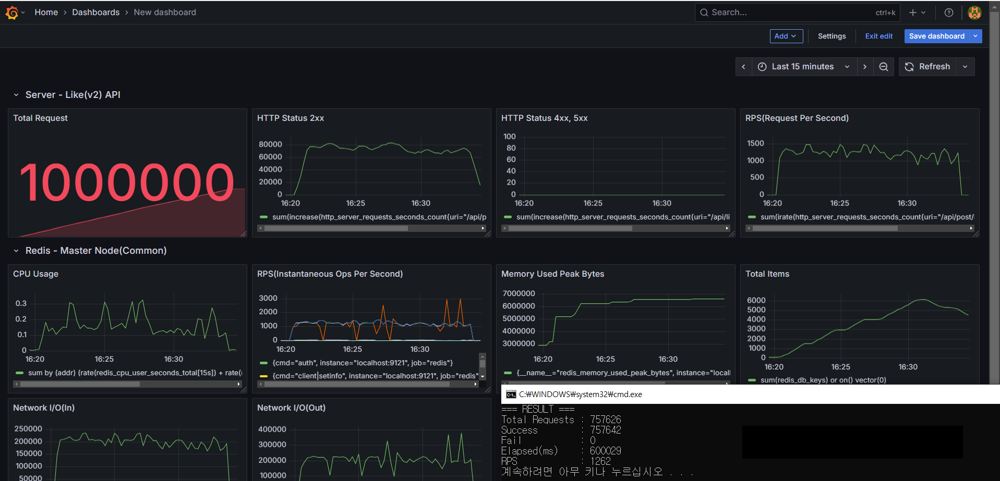
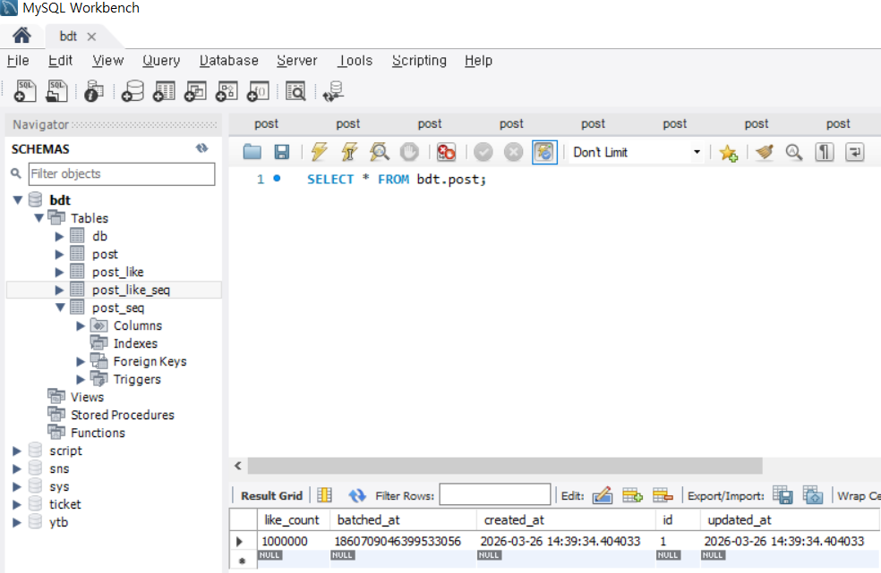
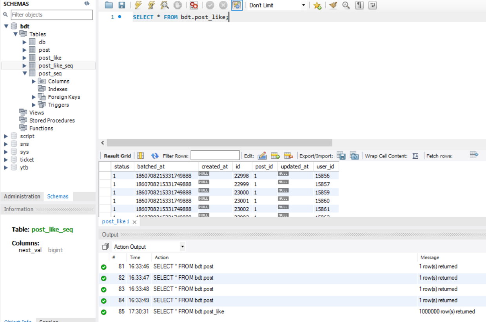

<details>
<summary>ch01: ping-test</summary>

## 1. 목표

매우 가벼운 REST API에 1만건의 동시요청을 보내고 문제발생 여부 확인

## 2. Server 구성

### 2.1 Filter Chain

### CustomFilterChain

- **HttpLoggingFilter & ResponseWrapper**
    - HTTP 요청/응답을 로깅하기 위한 필터
    - 실험 시 로깅으로 인한 오버헤드를 제거하기 위해 비활성화 (@ConditionalOnProperty 기반 on/off)
- **CorsFilter**
    - Local 환경(IPv4, IPv6)에서 허용된 요청만 통과
    - 그 외 접근은 차단

---

### 2.2 Endpoint

### PingController

- 비즈니스 로직이 없는 단일 엔드포인트(REST)
- 요청
    
    ```bash
    curl -X GET http://localhost:8080/api/ping
    ```
    
- 응답
    
    ```
    pong
    ```
    

---

## 3. attack-cli 구성

### 3.1 기술 스택

- Java 21 (SE)
- Gradle Wrapper (`gradlew`)
- `java.net.http.HttpClient` 기반 구현

---

### 3.2 cli-module

- **AttackConfig**
    - 공격에 사용될 변수가 담기는 불변 객체(record)
- **cliParser**
    - cli script를 파싱하여 AttackConfig로 변환
- **AttackScenario**
    - 공격 방식을 정의할 인터페이스, 구현체로 PingScenario 사용
- **PingScenario**
    - Ping 공격에 사용될 HttpRequest를 구성하고 반환
- **ScenarioRequestResolver**
    - Scenario를 해석하고 올바른 HttpRequest로 변환
- **AttackRunner**
    - HttpClient를 구성하고 HttpRequest 전송 (latch, platform thread, thread pool)
    - 실행 결과 로깅
- **Main**
    - cli args를 parser에 전달
    - runner 실행
    ---
    

### 3.3 config 구성

```java
public record AttackConfig(
    String url,
    int threads,              // 동시에 실행될 워커 스레드 수
    int requestsPerThread,    // 단일 스레드가 보내는 요청 수
    boolean burst,            // burst 모드 여부
    String scenario            // 공격 시나리오명 (예: ping)
) {}

```

- **threads**: 병렬로 실행되는 플랫폼 스레드 수
- **requestsPerThread**: 각 스레드가 수행할 요청 횟수
- **burst**:
    - `false`: 모든 스레드가 준비된 뒤 동시에 요청 시작
    - `true`: 준비 대기 없이 즉시 요청을 발사
- **scenario**: CLI 실행 시 선택되는 공격 시나리오

---

## 4. 실행 스크립트 예시

### 4.1 Build

```java
cd attacker-java/cli/attack
./gradlew clean jar
```

### 4.2.1 Linux / WSL / Bash

```bash
java -jar build/libs/attack.jar \
  --scenario ping \
  --url http://localhost:8080 \
  --threads 10 \
  --rpt 1000 \
  --burst true
```

---

### 4.2.2 Windows (PowerShell / CMD)

```bash
java -jar build/libs/attack.jar ^
  --scenario ping ^
  --url http://localhost:8080 ^
  --threads 10 ^
  --rpt 1000 ^
  --burst true
```

---

## 5. 실행 방식 상세

### 5.1 burst = false (Non-Burst Mode)

1. `threads` 개수만큼 플랫폼 스레드를 생성
2. 각 스레드를 스레드 풀에 적재
3. 동시에 `CountDownLatch`의 카운트를 감소
4. 모든 스레드가 준비되어 latch가 `0`이 되면
5. 각 스레드가 `requestsPerThread` 만큼 요청 전송

> 모든 스레드가 동일한 시점에서 시작

---

### 5.2 burst = true (Burst Mode)

1. `threads` 개수만큼 플랫폼 스레드를 생성
2. 스레드 적재와 동시에 대기 없이 요청 전송
3. 각 스레드는 `requestsPerThread` 만큼 즉시 요청 수행
4. 전체 과정을 **10ms delay** 후 반복

>

---

## 6. 배치 파일 (in /scripts dir)

- **ping_10000req.bat**
    - burst = false
    - 10개 스레드 × 1000 요청
    - 동시 시작을 보장하는 실험
- **ping_10000req_burst.bat**
    - burst = true
    - 동일한 요청 수
    - 최대한 빠르게 요청을 몰아서 전송

---

## 7. 집계

```java
AtomicInteger success = new AtomicInteger(); // thread-safe한 카운트
AtomicInteger fail = new AtomicInteger();
```

- Success
    - HTTP Status `200` 응답 수
- Fail
    - `200`이 아닌 응답 수 + 에러 발생 수
- Elapsed(ms) : `end - start (currentTimeMillis)`
- Total Requests: `threads × requestsPerThread`
- RPS(Requests Per Second): `totalRequets * 1000L / elapsed`

---

## 8. 실행 결과 예시

### **ping_10000req.bat**


### **wsl (ubuntu, intellij terminal)**


---

## 9. 인사이트

rate limiter가 없는 환경에서도 단순하지만 많은 요청을 실패없이 처리했다. 이는 요청 수보다 단일 요청이 유발하는 비용의 크기가 더 큰 영향을 미친다는 점을 시사했다. 그럼에도, 비정상적으로 반복되고 많은 요청에도 서버가 아무런 제한을 하지않는 상태임을 확인할 수 있었다.

현재로써는 rate limiter의 당위성이 부족하기 때문에, 먼저 고비용 작업(network I/O, DB wrihte) API를 구성하는 방향으로 확장한다.
</details>
간단한 동작을 수행하는 엔드포인트에 1만번의 요청 공격을 보냅니다. 장애가 없음을 확인하고 서버 로직을 비용이 큰 작업(db-write)으로 확장합니다.

</br>
</br>
<details>
<summary>ch02: db-write attack</summary>

## 실험 환경

- **DB**: MySQL 8.0 (InnoDB)
  - `isolation level = REPEATABLE_READ (default)`
  - `auto commit = true (default)` (단, @Transactional 진입 시 트랜잭션 시작과 함께 autoCommit=false로 설정됨)
- **ORM**: Spring Data JPA (with Hibernate, ConnectorJ)
- **Connection Pool**: HikariCP
  - `maximumPoolSize = 10 (default)`
  - `connectionTimeout = 30000ms (default)`
---

## 실험 시나리오

CLI를 사용해 다음과 같은 공격 시나리오를 실행

- 대상 게시물: `postId = 1`
- 요청 사용자: `userId = 1`
- 총 요청 수: 10,000건
- 실행 방식:
  - 10개의 스레드가 각 1,000개의 요청을 동시에 시작

비정상적인 요청 공격으로 일반적인 유저 플로우에서 드러나지 않는 문제를 관찰
- 비정상적인 요청: user1이 post1에 만 번의 Like 요청을 **빠르게** 보냄

---

## 실험 결과 요약

- **최초 두 개의 트랜잭션만으로 Deadlock 발생**
- 이후 트랜잭션들은 커넥션을 점유한 채 대기
- 일부 요청은 커넥션을 할당받지 못하고 timeout

### CLI 결과

```text
Total Requests : 10000
Success        : 9991
Fail           : 9
Elapsed(ms)    : 49708
RPS            : 201
```

---
### Post Entity

```java
@Entity
@Table(name = "post")
public class Post extends BaseTime {

  @Id @GeneratedValue
  private Long id;

  private int likeCount;

  public void increaseLike() {
    this.likeCount++;
  }
}
```

- 게시물 엔티티
- `likeCount`는 트랜잭션 내에서 증가

---

### PostLike Entity

```java
@Entity
@Table(
  name = "post_like",
  uniqueConstraints = @UniqueConstraint(columnNames = {"post_id", "user_id"})
)
public class PostLike extends BaseTime {

  @Id @GeneratedValue
  private Long id;

  @ManyToOne(fetch = FetchType.LAZY)
  private Post post;

  private Long userId;
}
```

- 게시물과 사용자 간의 좋아요 관계 (1:N)
- `(post_id, user_id)` 조합에 **유니크 제약조건** 적용
  - 한 사용자는 하나의 게시물에 한 번만 Like 가능

---
### PostService

```java
@Service
@RequiredArgsConstructor
public class PostService {

  private final PostRepository postRepository;
  private final PostLikeRepository postLikeRepository;

  @Transactional
  public void like(LikeRequest request) {

    Post post = postRepository.findById(request.postId())
        .orElseThrow();

    if (postLikeRepository
        .existsByPostIdAndUserId(request.postId(), request.userId())) {
      return;
    }

    postLikeRepository.save(new PostLike(post, request.userId()));
    post.increaseLike();
  }
}
```

- 하나의 트랜잭션 안에서 **조회 → 존재 확인 → 삽입 → 업데이트**를 모두 수행
- 동시다발적 요청이 없는 경우에만 적합한 코드(이하 후술)

---
### Cli Request (in attacker-java dir)
```java
// ch02: DB-Write baseline
public class LikeScenario implements AttackScenario {

  AttackConfig config;

  public LikeScenario(AttackConfig config) {
    this.config = config;
  }

  @Override
  public HttpRequest toRequest() {

    String body = """
        { "postId": 1,
         "userId": 1}
        """;

    return HttpRequest.newBuilder()
        .uri(URI.create(config.url()))
        .header("Content-Type", "application/json")
        .POST(HttpRequest.BodyPublishers.ofString(body))
        .build();
  }
}
```

- postId=1인 Post에 userId=1로 PostLike 요청

---
### like_10000req.bat (in attacker-java dir)
```powershell
@echo off
cd /d "%~dp0.."
call scripts\common.bat

java -jar %JAR_PATH% ^
  --scenario like ^
  --url %BASE_URL% ^
  --threads 10 ^
  --rpt 1000 ^
  --burst false

pause
```
- 10개의 thread에서 동시에 각 1,000번의 req 전송
- 유니크 제약 조건 처리를 위해 **InnoDB는 내부적으로 s-lock을 사용**(select .. for update 등이 아니어도)
- 초기 2개의 요청만으로 **deadlock** 발생
---

## 데드락 원인

```
T1: post S-lock 보유  → post_like S-lock 대기
T2: post_like X-lock → post X-lock 대기

→ 순환 대기 발생
→ InnoDB가 T1을 롤백
```

<details>
<summary>개념 상세</summary>

1. T1은 post 레코드에 s-lock을 걸었다.
```text
index PRIMARY of table `bdt`.`post`
trx id 479984 lock mode S locks rec but not gap
```
단순 select 문에는 s-lock이 걸리지 않는다. 그럼에도 t1은 post 조회 시점에 s-lock을 걸었다.
이후 쿼리에서 lickCnt를 update하기 때문에 미리 걸어놓은 것일까? 아니다. InnoDB는 미래의 동작을 예측하지 않는다.
이유는, 유니크 제약조건이 걸려있기 때문이다. reapeatable read 격리 수준에서는 트랜잭션의 버전관리를 통해 일관성있는 읽기를 제공한다.
하지만, 유니크 제약조건에서 필요한 것은 과거의 스냅샷이 아닌 현재 레코드의 상태이다.

가령, t1과 t2 조회시점에 모두 레코드가 존재하지 않는 상태였고 이후 t1, t2에서 insert를 진행한다면 중복된 쓰기가 발생한다.
이는 t1과 t2 조회에서는 일관성있는 읽기가 보장되었지만, 결과적으로 유니크 제약조건을 위배한다.

때문에, t1 조회 시점에서 s-lock을 걸어 t2가 x-lock을 획득하지 못하게 해야한다. 이런 이유로 select문이 for update 등이 아니여도 innoDB는 무조건 s-lock을 걸게된다.

2. T2는 post_like 레코드에 x-lock을 걸었다.
```text
index UKpmmko3h7yonaqhy5gxvnmdeue of table `bdt`.`post_like`
trx id 479983 lock_mode X locks rec but not gap
```
요청이 동시에 발생했기 때문에 순서는 보장되지 않는다. 여기서는 T1의 트랜잭션이 마무리 되기 이전에 T2이 시작된다.
select가 아닌 update(increase likeCnt)가 이뤄져야 하기 때문에 x-lock을 점유한다.
특이사항으로는 T2의 tid가 더 작은(먼저 생성된) 값임을 확인할 수 있다. 이 역시 T2가 먼저 시작되었지만 순서가 보장되지 않았음을 의미한다.

3. T2는 post 레코드에 x-lock을 걸려고 기다린다.
```text
index PRIMARY of table `bdt`.`post`
trx id 479983 lock_mode X locks rec but not gap **waiting**
```
하지만, t1이 post의 s-lock을 선점한 상태이기 때문에 waiting한다.
(만약 s-lock을 걸려 했다면 s-lock은 공유가 가능하므로 기다리지 않는다. 하지만, x-lock을 걸려고하며 이는 t1이 s-lock을 쥐고있을 때 불가하다)

4. T1은 post_like 레코드에 s-lock을 걸려고 기다린다.
```text
index UKpmmko3h7yonaqhy5gxvnmdeue of table `bdt`.`post_like`
trx id 479984 lock mode S **waiting**
```
하지만, t2가 post_like x-lock을 선점한 상태이기 때문에 waiting한다.
(t2가 x-lock을 쥐고있을 때 t1이 s-lock을 거는 것 또한 불가하다)

=> 두 트랜잭션이 서로를 무한정 기다리며 데드락이 발생한다.

</details>
<details>
<summary>만약, 유니크 조건이 없었다면?</summary>
현재 서비스 로직은 Check-Then-Act 패턴을 취하고있다. (if exists, then return)
현재 실험은 유니크 조건이 걸려있기 때문에 데이터는 1개만 insert 되었다. (데드락이 발생할 지언정)
만약, 유니크 조건이 없었다면 서버의 exist 체크로는 db-write가 발생하는 시점의 정확한 스냅샷을 제공하지 못한다.
exists=false인 짧은 시간안에 요청이 모두 db로 접근하게되고, 그만큼의 중복 데이터가 생겨 일관성이 무너진다.
</details>
<details>
<summary>InnoDB 로그 상세</summary>

```text
-- Query: SHOW ENGINE INNODB STATUS;
-- Pretty Printed
ENGINE: InnoDB

=====================================
2025-12-18 18:27:12 0x3ccc
INNODB MONITOR OUTPUT
=====================================
Per second averages calculated from the last 32 seconds


-----------------
BACKGROUND THREAD
-----------------
srv_master_thread loops:
  26 srv_active
   0 srv_shutdown
1863 srv_idle

srv_master_thread log flush and writes: 0


----------
SEMAPHORES
----------
OS WAIT ARRAY INFO:
  reservation count 1081
  signal count      1054

RW-shared spins 0, rounds 0, OS waits 0
RW-excl   spins 0, rounds 0, OS waits 0
RW-sx     spins 0, rounds 0, OS waits 0

Spin rounds per wait:
  0.00 RW-shared
  0.00 RW-excl
  0.00 RW-sx


------------------------
LATEST DETECTED DEADLOCK
------------------------
2025-12-18 18:09:15 0x3d7c


*** (1) TRANSACTION:
TRANSACTION 479984, ACTIVE 30 sec inserting
mysql tables in use 1, locked 1
LOCK WAIT 4 lock struct(s), heap size 1128, 2 row lock(s), undo log entries 1
MySQL thread id 62, OS thread handle 17320, query id 51157
localhost 127.0.0.1 sh update

SQL:
insert into post_like
(created_at, post_id, updated_at, user_id, id)
values
('2025-12-18 18:09:15.35154', 1, '2025-12-18 18:09:15.35154', 1, 2)


*** (1) HOLDS THE LOCK(S):
RECORD LOCKS space id 2625 page no 4 n bits 72
index PRIMARY of table `bdt`.`post`
trx id 479984 lock mode S locks rec but not gap

Record lock, heap no 2
PHYSICAL RECORD: n_fields 6; compact format; info bits 0
 0: len 8; hex 8000000000000001
 1: len 6; hex 0000000752ea
 2: len 7; hex 81000001070110
 3: len 4; hex 80000000
 4: len 8; hex 99b86522290336b7
 5: len 8; hex 99b86522290336b7


*** (1) WAITING FOR THIS LOCK TO BE GRANTED:
RECORD LOCKS space id 2629 page no 5 n bits 72
index UKpmmko3h7yonaqhy5gxvnmdeue of table `bdt`.`post_like`
trx id 479984 lock mode S waiting

Record lock, heap no 2
PHYSICAL RECORD: n_fields 3; compact format; info bits 0
 0: len 8; hex 8000000000000001
 1: len 8; hex 8000000000000001
 2: len 8; hex 8000000000000001


*** (2) TRANSACTION:
TRANSACTION 479983, ACTIVE 30 sec starting index read
mysql tables in use 1, locked 1
LOCK WAIT 6 lock struct(s), heap size 1128, 3 row lock(s), undo log entries 1
MySQL thread id 60, OS thread handle 17172, query id 51159
localhost 127.0.0.1 sh updating

SQL:
update post
set like_count = 1,
    updated_at = '2025-12-18 18:09:15.352537'
where id = 1


*** (2) HOLDS THE LOCK(S):
RECORD LOCKS space id 2629 page no 5 n bits 72
index UKpmmko3h7yonaqhy5gxvnmdeue of table `bdt`.`post_like`
trx id 479983 lock_mode X locks rec but not gap

Record lock, heap no 2
PHYSICAL RECORD: n_fields 3; compact format; info bits 0
 0: len 8; hex 8000000000000001
 1: len 8; hex 8000000000000001
 2: len 8; hex 8000000000000001


*** (2) WAITING FOR THIS LOCK TO BE GRANTED:
RECORD LOCKS space id 2625 page no 4 n bits 72
index PRIMARY of table `bdt`.`post`
trx id 479983 lock_mode X locks rec but not gap waiting

Record lock, heap no 2
PHYSICAL RECORD: n_fields 6; compact format; info bits 0
 0: len 8; hex 8000000000000001
 1: len 6; hex 0000000752ea
 2: len 7; hex 81000001070110
 3: len 4; hex 80000000
 4: len 8; hex 99b86522290336b7
 5: len 8; hex 99b86522290336b7


*** WE ROLL BACK TRANSACTION (1)


------------
TRANSACTIONS
------------
Trx id counter 480001
Purge done for trx's n:o < 479999 undo n:o < 0
state: running but idle
History list length 0


LIST OF TRANSACTIONS FOR EACH SESSION:
---TRANSACTION 283709979839384, not started
0 lock struct(s), heap size 1128, 0 row lock(s)

---TRANSACTION 283709979838608, not started
0 lock struct(s), heap size 1128, 0 row lock(s)

---TRANSACTION 283709979837832, not started
0 lock struct(s), heap size 1128, 0 row lock(s)

---TRANSACTION 283709979837056, not started
0 lock struct(s), heap size 1128, 0 row lock(s)

---TRANSACTION 283709979836280, not started
0 lock struct(s), heap size 1128, 0 row lock(s)

---TRANSACTION 283709979835504, not started
0 lock struct(s), heap size 1128, 0 row lock(s)

---TRANSACTION 283709979834728, not started
0 lock struct(s), heap size 1128, 0 row lock(s)

---TRANSACTION 283709979833952, not started
0 lock struct(s), heap size 1128, 0 row lock(s)

---TRANSACTION 283709979833176, not started
0 lock struct(s), heap size 1128, 0 row lock(s)

---TRANSACTION 283709979832400, not started
0 lock struct(s), heap size 1128, 0 row lock(s)

---TRANSACTION 283709979825416, not started
0 lock struct(s), heap size 1128, 0 row lock(s)

---TRANSACTION 283709979824640, not started
0 lock struct(s), heap size 1128, 0 row lock(s)

---TRANSACTION 283709979823864, not started
0 lock struct(s), heap size 1128, 0 row lock(s)

---TRANSACTION 283709979823088, not started
0 lock struct(s), heap size 1128, 0 row lock(s)


--------
FILE I/O
--------
I/O thread 0 state: wait Windows aio (insert buffer thread)
I/O thread 1 state: wait Windows aio (read thread)
I/O thread 2 state: wait Windows aio (read thread)
I/O thread 3 state: wait Windows aio (read thread)
I/O thread 4 state: wait Windows aio (read thread)
I/O thread 5 state: wait Windows aio (write thread)
I/O thread 6 state: wait Windows aio (write thread)
I/O thread 7 state: wait Windows aio (write thread)
I/O thread 8 state: wait Windows aio (write thread)

Pending normal aio reads:  [0, 0, 0, 0]
Pending normal aio writes: [0, 0, 0, 0]

Pending flushes:
  log: 0
  buffer pool: 0

OS file reads  : 1213
OS file writes : 2894
OS file fsyncs : 1403


-------------------------------------
INSERT BUFFER AND ADAPTIVE HASH INDEX
-------------------------------------
Ibuf: size 1, free list len 0, seg size 2, 0 merges

Hash table size 34679


---
LOG
---
Log sequence number          7927516281
Log buffer assigned up to    7927516281
Log buffer completed up to   7927516281
Log written up to            7927516281
Log flushed up to            7927516281
Last checkpoint at           7927516281


----------------------
BUFFER POOL AND MEMORY
----------------------
Buffer pool size        8191
Free buffers            6753
Database pages          1429
Old database pages       507
Modified db pages         0


--------------
ROW OPERATIONS
--------------
Number of rows inserted 62
Number of rows updated  10
Number of rows deleted   0
Number of rows read  40059


============================
END OF INNODB MONITOR OUTPUT
============================

```

</details>

---

## 장애 전파 과정

### 1. t1 <-> t2 race condition 발생, innoDB가 dead lock을 감지하여 t1 rollback

InnoDB 판단

```text
// db
*** WE ROLL BACK TRANSACTION (1)
```

- 순환 대기(deadlock)를 감지
- 비용이 낮다고 판단한 `Transaction 1`을 롤백

---

### 2. 연쇄 효과: 커넥션 풀 고갈
- t1의 희생(롤백)으로 인해 t2만 수행되며 데드락이 해제되었음
- 이후 트랜잭션은 pool을 점유한 채 대기하다가 T1 rollback 이후 정상 수행
- t3, t4.. 부터는 duplicate key 예외 발생 (정상적으로 unieque constraints를 적용받는 중)
- 이후 9991개의 트랜잭션이 처리되었음
```text
// server
java.sql.SQLIntegrityConstraintViolationException: Duplicate entry '1-1' for key 'post_like.UKpmmko3h7yonaqhy5gxvnmdeue' // 의도된 예외
```

### 3. 연쇄 효과: deadlock 처리 동안 지연되며 일부 트랜잭션은 타임아웃 발생
- 30초의 타임아웃 동안 connection pool 할당(waiting 상태 돌입)조차 받지 못한 트랜잭션은 요청 자체가 실패됨

```text
// server
java.sql.SQLTransientConnectionException:
HikariPool-1 - Connection is not available,
request timed out after 30002ms
(total=10, active=10, idle=0)

// db
LIST OF TRANSACTIONS FOR EACH SESSION:
---TRANSACTION 283709979839384, not started
0 lock struct(s), heap size 1128, 0 row lock(s)

---TRANSACTION 283709979838608, not started
0 lock struct(s), heap size 1128, 0 row lock(s)

...
```

## CLI 실행 결과

```text
Total Requests : 10000
Success        : 9991
Fail           : 9
Elapsed(ms)    : 49708
RPS            : 201
```

목표(장애발생 우려 판단 기준):
 - 엄밀한 변인 통제는 사실상 불가능하여 반복 실험 채택
 - 최소 10번 최대 100번의 반복 간, 한 번이라도 Fail 발생 시 분석

결과:
- Fail 횟수는 비결정적, 그럼에도 10번의 시행에서 모두 Fail이 존재(9~1043)
- 충돌을 일으킨 트랜잭션 쌍 또한 달라질 수 있었음
---

  ## 인사이트
  언뜻 논리적으로는 문제없어 보이는 코드도, 같은 유저가 동시에 요청을 하는 비정상적인 경우에는 심각한 문제가 발생했다. 처음에는 단순한 병목(응답 지연)을 예상했으나, 데드락이라는 고수준 위험까지 유발될 수 있었다. 이를 막기위해 서버 로직에서 대안을 마련하는 것보다는, 서버 이전 레이어에서 트래픽 자체를 차단하고 정보를 수집하여 밴을하는 방법이 보편적이라고 한다. 그럼에도, 현재 서버 코드는 정상적인 요청에 대해서도 결함이 있는 단순한 형태라고 생각했다. 때문에 서버 로직을 좀 더 견고히하는 목표를 다음으로 잡았다.
</details>
공격으로 DB 장애(deadlock) 유도에 성공합니다. 서버로 전파되는 과정을 관찰하고 공격 방지 체계의 당위성을 확립합니다.

</br>
</br>
<details>
<summary>ch03: resolving deadlocks via server-side logic</summary>

### 데드락은 왜 발생했을까?

## 데드락 발생조건 4가지

1. 상호 배제(Mutual Exclusion) - 프로세스가 접근하는 자원에 대해 배타적 통제권이 보장
2. 점유와 대기 (Hold and Wait) - 프로세스가 자원을 점유한 상태에서 다른 자원을 기다림
3. 비선점 (No Preemption) - 프로세스는 다른 프로세스의 자원을 빼앗을 수 없음 (프로세스 자신이 반납해야 함)
4. 환형 대기 (Circular Wait) - 서로가 서로의 자원을 해제하기를 기다림

‘환형’ 이라는 용어 때문에 원을 이룰만큼 많은 프로세스가 있어야 한다고 생각할 수 있으나, 2개 이상이면 가능합니다. (제 데드락도 2개의 트랜잭션으로 인해 발생했습니다)

데드락이 발생하려면 **4가지 요인이 필요조건**이기 때문에,

**하나라도 만족하지 못한다면** 데드락은 일어나지 않습니다.

또한, **하나라도 불만족 시킨다면** 데드락을 해결할 수 있습니다.

---

## 내 서버는 필요조건 4가지를 만족했는가? 불만족시킬 수 있는가?


### 1. 상호 배제(Mutual Exclusion) - 프로세스가 접근하는 자원에 대해 배타적 통제권이 보장

- 만족 여부: O

Post와 PostLike 모두 임계영역(Critical Section)으로 사용되고 있습니다. 또한, InnoDB의 배타적 잠금(x-lock)은 특정 레코드에 대해 **단 하나의 트랜잭션만 점유** 권한을 가질 수 있도록 제한하므로 상호 배제 조건을 만족합니다.

- 불만족 가능성: 없음

이를 불만족시키는 방법은 없거나 매우 어렵습니다.

트랜잭션마다 다른 테이블을 사용할 수도, 테이블에 무한한 동시 접근을 허용할 수도 없기 때문입니다. 대부분의 서비스에서도 필연적으로 만족해야 할 사항입니다. 다른 조건을 불만족시켜야 합니다.


### 2. 점유와 대기 (Hold and Wait) - 프로세스가 자원을 점유한 상태에서 다른 자원을 기다림

- 만족 여부: O

단순 select문은 s-lock을 걸지 않습니다. 하지만, 저의 로직은 유니크 제약조건 때문에 exists에 s-lock을 점유합니다. (이유는 이전 readme에 있습니다) 이후 insert/update에 x-lock 승격을 시도했습니다. 즉, **'내가 가진 공유 잠금(S)은 놓지 않으면서, 남이 가진 공유 잠금이 풀려야 얻을 수 있는 배타적 잠금(X)으로의 승격을 기다리는'** 점유와 대기를 형성했습니다.

- 불만족 가능성: 높음

S-Lock을 X-Lock으로 **승격시키는 과정없이**, 단일 락만 걸고 작업을 마칠 방법이 있다면 해결할 수 있습니다. 이를 서비스 로직으로 유도하거나, 적절한 SQL을 찾아야합니다.


### 3. 비선점 (No Preemption) - 프로세스는 다른 프로세스의 자원을 빼앗을 수 없음 (프로세스 자신이 반납해야 함)

- 만족 여부: O

DB에서 사용된 트랜잭션들은 모두 자신의 lock을 자진반납하지 않습니다. (일어났던 rollback 또한, 어쩔 수 없는 상황에서 InnoDB가 강제 종료시킨 것입니다)

- 불만족 가능성: 매우 낮음

다른 프로세스의 자원을 뺏지 못하는 것은 DB 엔진 레벨의 규칙으로 제어하기 어렵습니다. 또한 OS에서도 프로세스간 자원을 공유할 때는 시스템콜로 중재자에게 요청하는 등 대부분의 SW에서 적합하지 않은 설계입니다. 다른 조건을 불만족시킬 방법을 찾아야 합니다.


### 4. 환형 대기 (Circular Wait) - 서로가 서로의 자원을 해제하기를 기다림

- 만족 여부: O

기존 로직에서 t1, t2는 각각 Post, PostLike에 대한 x-lock을 가진 채로 서로의 PostLike, Post x-lock을 가지려 했습니다.(정확히는 s-lock을 공유한 채로 승격시키려) 이는 순환 대기를 이루며 꼬리가 맞물려 환형을 이루었습니다.

- 불만족 가능성: 높음

lock의 획득 순서를 정형화(일직선화) 시켜서 해결할 수 있습니다. 기존은 t1은 Post, t2는 PostLike x-lock을 먼저 획득하며 순서가 엇갈려 순환대기가 일어났습니다.


</br>


결과적으로,

제 서비스는 **데드락 필요조건을 모두 만족**하기에 발생할 수 있었고,

해결하기 위해 2번 혹은 4번을 불만족 시키거나, 둘 다 불만족 시킬 방법을 찾아야합니다.

이후의 방법을 통해 **2번을 불만족** 시키는 방법으로 데드락을 해결했습니다.

---

## 채택되지 않은 선택지

### 1. 낙관적 락(Optimistic Lock) 적용

Post 테이블에 update version 컬럼을 놓습니다. 트랜잭션 간 update version이 맞을 때만 update를 수행합니다. 이전에 발생한 **데드락을 방지**할 수 있습니다. 이론상 update loss는 발생하지 않지만(타임아웃과 재시도 횟수가 무한) 이는 불가능하므로 **loss를 염두**에 둡니다.

단점은 다음과 같습니다.

lost 트랜잭션에 대한 **retry 로직이 앱 레이어에 필수**로 요구됩니다. retry로 인해 **DB비용이 증가**하고 커넥션 풀을 max로 점유할 상황도 생길 수 있습니다. 또한, retry된 트랜잭션은 꼭 성공한다는 보장도 없습니다. 결과적으로, 저의 cli 요청에서는 충분히 많은 요청을 동시에 보내고있고, **많은 부하**를 일으킬 것입니다. (낙관적 락이 적합한 상황 또한 충돌이 **가끔 발생**하는 경우입니다.)

현재 cli 공격은 **단점이 부각되는 상황**이라 판단하여 채택하지 않습니다.

---

### 2. 비관적 락(Pessimistic Lock) 적용

update 쿼리는 x-lock을 건 상태로만 수행합니다. 다음 트랜잭션은 lock을 획득하지 못하여 대기합니다. 선행 트랜잭션이 완료되면 다음 트랜잭션이 x-lock을 걸고 update를 진행합니다. **데드락을 방지**할 수 있습니다. **update loss는 발생하지 않습니다**.

단점은 다음과 같습니다.

순서대로 엄격한 수준의 lock을 걸고 update를 진행하는 방식입니다. 정합성에는 효과적이나, **부하가 몰리면 병목이 필연적**으로 생깁니다. 그렇기에 엄격한 데이터에 채택되는 방식이고, 일반적으로 Like에는 과한 설계로 취급됩니다. cli 공격에 대비해 **적용은 할 수 있다**고 판단하여 선택지로 놓았었습니다.

---

## 채택된 선택지


### 1. Insert Ignore

```java
@Repository
public interface PostLikeRepository extends JpaRepository<PostLike, Long> {

    @Modifying(clearAutomatically = true)
    @Query(value = "insert ignore into post_like (post_id, user_id, created_at, updated_at) "
        + "values (:postId, :userId, now(), now())", nativeQuery = true)
    int insertIgnore(@Param("postId") Long postId, @Param("userId") Long userId);
}
```

일단 insert를 시도합니다. insert에 성공했다면 업데이트 된 row의 개수를 반환합니다.

**성공했다면 1**을, 유니크 조건에 의해 **실패했다면 0**을 반환합니다.

앞서 데드락의 원인은 서버에서 exists를 수행 + x-lock을 거는 엔티티의 순서가 보장되지 않음으로 상호 대기가 일어난 것이었습니다.

즉, "조회(S) 후 수정(X)" 사이의 간극에서 발생한 것이었습니다.

insert ignore은

1. 우선 x-lock을 시도합니다.
2. 만약, 이미 다른 트랜잭션이 해당 레코드에 lock을 걸고 있다면 대기합니다.
3. 중복된 키가 발견되면 에러를 내는 대신 내부적으로 **s-Lock으로 전환했다가 즉시 해제**하거나 무시합니다.

x-lock을 걸고 시작하므로 언뜻 보기에는 비관락 방식처럼 보일 수 있으나,

SELECT … FOR UPDATE 를 통해 다른 트랜잭션이 점유 기간동안 접근하지 못하게 하는 것이 아니라

**데이터 수정 전의 찰나**에만 정합성을 위해 x-lock을 겁니다.

(innoDB에서는 원래 update 동작에 무조건 x-lock을 사용합니다 = 원래 일부는 비관적입니다)


단점은 다음과 같습니다.

선행 조건 없이 항상 insert를 시도하기 때문에 DB단에서의 비용이 증가합니다.

기존의 exists() → insert() 의 DB 2번접근 구조보다는 효율적이나, **최적화 여지**가 있습니다.

때문에 다음 챕터에서 Redis 기반의 **Request Collapsing**을 혼합하여 보완합니다.

---

### 2. Atomic Update

```java
@Repository
public interface PostRepository extends JpaRepository<Post, Long> {

    @Modifying(clearAutomatically = true)
    @Query(value = "update post set like_count = like_count + 1, updated_at = now() "
        + "where id = :postId", nativeQuery = true)
    int increaseAtomicLikeCount(@Param("postId") Long postId);

    @Modifying(clearAutomatically = true)
    @Query(value = "update post set like_count = like_count - 1, updated_at = now() "
        + "where id = :postId", nativeQuery = true)
    int decreaseAtomicLikeCount(@Param("postId") Long postId);
}
```

기존에는 likeCnt select → likeCnt += 1 update 방식을 사용했습니다. 이를 하나의 원자적 연산으로 통합(atomic의 범위를 늘려)합니다.

그러면, “likeCnt 조회와 동시에 likeCnt +=1” 방식으로 바꿀 수 있습니다.

다음과 같은 시나리오를 방지합니다.

1. likeCnt=0인 Post가 존재합니다.
2. userId = 1~100인 유저가 동시에, 같은 Post의 likeCnt를 증가시킵니다. 앞선 insert ignore 결과가 모두 1일 것이며, 이는 유효한 요청이므로 likeCnt = 100이 되어야 합니다.
3. 그러나, likeCnt에서 race condition이 발생하여 값이 100 이하의 예상치 못한 값으로 갱신됩니다.

비관적 락에 반해, 다음과 같은 절차를 가집니다. (앞서, 낙관적 락은 적용하지 않기로 했었습니다)

- 기존 방식에서는 select 이후 애플리케이션 로직을 수행한 뒤 update 실행하며,
비관적 락의 경우 이 **전체 구간 동안 x-lock을 점유**하게 됩니다.
- 반면, atomic update는 조회와 갱신을 하나의 sql로 통합하여
**update가 실행되는 순간에만 x-lock을 획득**합니다.

=> x-lock은 InnoDB에서 update에 필연적이여서 없앨 순 없기에,
그 점유 범위를 DB 엔진 내부 연산으로 축소합니다.


결과적으로, lock의 점유 구간이 줄어들어 **성능에서도 유리하며 가장 깔끔한**(적용할 상황이 제한적이지만, 적용 가능하면 lock보다 나은) 방법이라고 판단하여 채택했습니다.

확장성이 적다(다른 시나리오에 재사용하려면 충분한 고민이 필요하다)는 단점이 있지만, 추후 충분히 생각하거나 별도의 쿼리를 놓으면 됩니다. 일반적으로도 적용만 가능하다면 best practice로 꼽힙니다.

---

### 서비스단 코드

```java
@Service
@RequiredArgsConstructor
public class PostService {

    private final PostRepository postRepository;
    private final PostLikeRepository postLikeRepository;

    @Transactional
    public void like(LikeRequest request) {

				// case: fk가 없는 상태에서 insert 시도
        int result = postLikeRepository.insertIgnore(request.postId(), request.userId());

        if (result > 0) { // case: 동일 postLike가 미존재
            int updatedCount = postRepository.increaseAtomicLikeCount(request.postId());

            if (updatedCount == 0) { // case: 부모 Post가 없으므로 rollback
                throw new EntityNotFoundException("Post not found.");
            }
            
            // case: 부모 Post가 있으므로 commit
        }
        
        // case: 동일 postLike가 존재 - DB에서 ignored
    }
}
```

### 테스트 코드

```java
    @Test
    @Transactional
    void like_shouldThrowEntityNotFoundException_whenPostDoesNotExistAndWithNoFKConstrains() { // 의도된 예외 던지나 검증
        // given
        Long nonExistentPostId = 9999L;
        LikeRequest request = new LikeRequest(nonExistentPostId, 100L);

        // when & then
        assertThatThrownBy(() -> postService.like(request))
            .isInstanceOf(EntityNotFoundException.class)
            .hasMessageContaining("Post not found."); // PostId는 보안상 메세징하지 않는 것이 좋다.
    }
```

Post ↔ PostLike는 FK 제약조건을 가지고 있지 않습니다. 동작 검증은 주석과 테스트 코드로 수행했습니다.

---

## 실험 - 데드락을 방지했을까?


**요청이 한 번이라도 Fail하거나, Post or PostLike 테이블의 row > 1인 경우**를 실패로 놓았습니다.


```
@echo off
cd /d "%~dp0.."
call scripts\common.bat

java -jar %JAR_PATH% ^
  --scenario like ^
  --url %BASE_URL%/post/like ^
  --threads 10 ^
  --rpt 1000 ^
  --burst false

pause
```

기존의 like_10000req.bat 파일을 재사용합니다. 10개의 스레드가 각 1000번의 요청을 보냅니다.

---


10번 시도했고, 모두 Fail 혹은 데이터 손상이 발생하지 않았음을 확인했습니다.


---

인사이트

Like라는 단순한 도메인 덕에 적은 비용으로 데드락을 해결할 수 있었습니다.  s-lock → x-lock 승격과정을 제거하고, 단일 x-lock 시퀀스로 통합하여 데드락 필요조건 중 '점유와 대기'를 파괴하는 방식이었습니다. 접하기 어려운 문제를 해결해볼 수 있었지만, 복잡한 도메인에서는 이정도로 해결 될 문제는 아닐 것이라 생각했습니다.

그럼에도 더 복잡한 도메인을 다루기보다는, Like의 특성을 좀 더 엄밀히 정의하고 서버 외에서의 최적화 기법을 추가하려 합니다. 현재는 무조건 insert를 수행하며, 모든 요청에 대해 DB접근을 수행하고 있습니다.

또한, cli 지표는 서버와 상이하기에 서버측 모니터링 툴을 붙이려합니다.

</details>

데드락 발생요인을 엄밀히 분석합니다. 서버/DB에서의 해결책을 나열하고 시나리오에 적합한 방식을 적용합니다.
</br>
</br>
<details>
<summary>ch04-1: Scaling to 500k Requests with Redis</summary>

### 개요

10만 건의 트래픽 수용에 실패한 API를 개선했다. 50만 건의 수용을 목표로 했으며 성공했다. 여기에 사용된 최적화 중 Redis를 중심으로 서술한다.

### **1. 병목 요인 분석**

- **현상:** `Like API (v1)` 모델은 10만 건의 동시 트래픽 환경에서 `Connection Timeout`을 유발하며 시스템 마비를 초래함.
- **원인:** HTTP 요청과 DB Connection이 1:1로 맵핑 되는 구조적 한계.
- **분석:** `Atomic Upsert`를 통해 쿼리 횟수를 절감(2회→1회)했음에도 불구하고, 물리적인 **I/O Overhead** 자체가 Connection Pool의 임계치를 상회함.

### 2. 가설(해결법) 세우기

1. 1번의 HTTP 요청이 1번의 DB Connection을 사용하는 구조를 무너뜨려야 한다.

Thread Pool을 무작정 늘리는 것은 한계가 있고, CP=1000까지 늘린다고 50만 건이 수용되지도 않았다. 오히려 과도한 증설은 컨텍스트 스위칭 비용을 야기한다. DB Network I/O를 CPU I/O로 대체할 무언가가 필요했다. 그래서 전처리(Aggregation) 계층으로 캐시(Redis)를 도입했다.

2. Thoughput은 DB Connection을 오랫동안 점유하지 않을 만큼 빨라야 한다.

50만 건의 트래픽은 꽤 오랜 기간 연속된다. 단순히 입구가 넓다고 병목이 풀리는 것이 아니었다. 흐름을 처리하는 속도가 입력보다 빠르거나, 적당히 느려야한다. 그래서 batch를 도입했고, 후에는 병렬 batch로 확장했다.

### 3. 전처리 아이디어: 데이터 압축에 유리한 형태로 가공한다.

좋아요(like)는 다음과 같은 Binary 특성이 있다고 생각했다.

- 미클릭(0) 혹은 클릭(1) 상태만 존재한다.
- 눌렀다가 취소한 경우 또한 미클릭(0) 상태 취급할 수 있다.
- 중간의 상태는 그다지 중요하지 않다. 최종 값(final status)에 주목한다. (0→1→0→1→1 = 1)
- 동시 요청 환경에서는 충돌(conflict)이 발생할 수 있다. (0 → 0, 1 → 1)

### 3-1. Key Grouping: 이벤트를 모두 기록하지 않고 저장에 유리한 형태로 가공한다.

Redis Hash를 다음과 같이 구성한다.

- postId:userId:{status} - 한 게시물에 연관된 사용자의 최종 좋아요 상태(0 or 1)
- post-like:batch:snapshot:{batchSeq} - BATCH_SIZE만큼 한 번에 처리 될 데이터(shapshot, chunk)
- post-like:batch:status:{batchSeq} - shapshot의 DB 반영 여부를 추적하는 영역(pending or success)

득:

- Key(postId)를 기준으로 묶기에 향후 쿼리(Join)에 성능 이점이 있다.
- 이벤트 저장 방식에 비해 요구되는 필드(Overhead)가 적다.
- 같은 사용자와 같은 게시글에 한해서는, 수 만 번의 요청에도 1 Bit만 저장해도 된다.
- 정합성만 엄밀히 보증된다면, 장애 복구 시 웜업 비용이 적다.

실:

- 이벤트 자체를 기록하지 않아 사건 기반의 복구가 불가능하다. 장애 대응에 보다 엄밀해야 한다.
- 인기 게시글(Hot Spot)에는 수 만개의 userId가 연관될 수 있다. 게시글(postId) 기준으로 배치 처리를 하면 절대 안된다. 배치 사이즈를 고정시킬 청크 분리 기준이 필요하다.

### 3-2. XOR 논리식: 동시 요청에 대응하고 안전한 집계를 수행한다.

동시 요청 환경에서는 다음과 같은 비정상적인 요청이 있을 수 있다.

- 클릭(1) 상태에서 클릭(1) 시도
- 미클릭(0) 상태에서 미클릭(0) 시도

실생활을 예시로 한다면,

하나의 계정으로 여러 환경(데스크탑, 모바일, …)에서 특정 게시글에 좋아요를 동시 클릭(0.n ~ 0.0n ms 단위로)하는 경우이다.

이는 흔하지 않은 경우지만, ch03에서는 Deadlock의 원인이 되었다. 이를 해결했더라도, 정합성을 훼손할 여지가 있음은 변하지 않는다.

이를 처리하는 방식은 비정상적인 요청을 충돌(Conflict)처리하는 것이다. 나는 Http status 4xx인 Expected error 취급했다. 해당 에러가 발생할 경우, Redis는 Update하지 않고 조용히 무시한다. 이를 Client에도 전달하여, 향후 기술할 Gracefull Rollback을 수행하게 한다.

다음과 같은 요청은 정상적인 요청 취급한다.

- 클릭(1) 상태에서 미클릭(0) 시도
- 미클릭(0) 상태에서 클릭(1) 시도

### 3-3. 멱등성 보장: 배치 순서 역전에 내성을 부여하여 병렬 배치를 가능하게 한다.

앞서 좋아요를 Binary 값으로 취급한다면, 다음과 같은 논리식을 세울 수 있었다.

이는 최종 값을 항상 진실의 원천으로 택하는 LWW(Last-Write-Wins) 전략과 Optimistic Lock 기법이 결합된 형태이다.

득:

1. 배치 순서가 뒤바뀌어도 증분 값(like_count)의 정합성이 유지된다.
2. 배치 순서가 뒤바뀌어도 사용자 별 최종 좋아요 상태(like)가 유지된다.

```java

A: post_like 테이블 B: batch data 임시 테이블 C:post 테이블

---------------------------

CASE(A.batched_at < B.batched_at): // 테이블이 현재 배치보다 이전 데이터를 저장 중
- CASE(A.status = 0, B.status = 1)
A.status = B.status
A.batched_at = B.batched_at
C.like_count++
C.batched_at = B.batched_at

- CASE(A.status = 1, B.status = 0)
A.status = B.status
A.batched_at = B.batched_at
C.like_count--
C.batched_at = B.batched_at

- CASE(A.status = 1, B.status = 1)
no ops

- CASE(A.status = 0, B.status = 0)
no ops

CASE(A.batched_at > B.batched_at): // 테이블이 최신 데이터를 저장 중(= 배치 순서 역전 발생)

- CASE(A.status = 0, B.status = 1)
no ops

- CASE(A.status = 1, B.status = 0)
no ops

- CASE(A.status = 1, B.status = 1)
no ops

- CASE(A.status = 0, B.status = 0)
no ops

CASE(A.batched_at = B.batched_at): // 이런 경우는 seq가 정상일 때 존재하지 않음
```

### 3-4. Batch Snapshot 구성 : 일관된 크기의 청크로 분리한다.

한 게시글(Hot Spot)에 몇 만개의 좋아요가 몰려있다면,

- 배치 사이즈가 엉망이된다. (한 개 ~ 수 만 개)
- O(n)의 탐색이 병목을 일으켜 제한된다.

이는 Redis에서 지원하는 Lua Script를 통해 해결했다. 주요 특징은 다음과 같다.

- Atomic 연산을 지원한다.
- 서버(Spring Redis Template)와 통신하지 않아 정합성 보장에 용이하다.
- Single Thread로 동작하므로 다른 Redis 연산을 Block한다. 가벼운 작업에만 사용해야 한다.

- like_batch_progress.lua
    
    ```lua
    -- [[ KEYS ]]
    -- KEYS[1]: post-like:batch:meta:last-time
    -- KEYS[2]: post-like:batch:meta:last-seq
    -- KEYS[3]: post-like:batch:queue
    
    -- [[ ARGV ]]
    -- ARGV[1]: server_time (currentTimeMillis)
    -- ARGV[2]: batch_size
    
    local redis_last_time = tonumber(redis.call('GET', KEYS[1]) or 0)
    local redis_last_seq = tonumber(redis.call('GET', KEYS[2]) or 0)
    local server_time = tonumber(ARGV[1])
    local batch_size = tonumber(ARGV[2])
    
    local resolved_time = server_time
    
    if resolved_time < redis_last_time then
        -- 시간 역전 발생 시 레디스 시각을 기준으로 하고 seq 1 증가
        resolved_time = redis_last_time
        redis_last_seq = (redis_last_seq + 1) % 1048576
        if redis_last_seq == 0 then resolved_time = resolved_time + 1 end
        -- 시간 충돌 발생 시 seq 1 증가
    elseif resolved_time == redis_last_time then
        redis_last_seq = (redis_last_seq + 1) % 1048576
        if redis_last_seq == 0 then resolved_time = resolved_time + 1 end
    else
        -- 문제가 없다면 seq 0부터 시작
        redis_last_seq = 0
    end
    
    -- 메타 데이터(last_time, last_seq) 레디스에 저장
    -- 지수 표기법 방지를 위해 포맷팅하여 저장
    local resolved_time_str = string.format("%.0f", resolved_time)
    redis.call('SET', KEYS[1], resolved_time_str)
    redis.call('SET', KEYS[2], redis_last_seq)
    
    -- 산술 연산 (resolved_time * 1048576)은 2^53을 넘어 정밀도가 파괴되므로 16진수 결합 사용
    -- 44비트 시간(11자리) + 20비트 seq(5자리) = 64비트 ID (16진수 문자열)
    local batch_seq = string.format("%011x%05x", resolved_time, redis_last_seq)
    local snapshot_key = "post-like:batch:snapshot:" .. batch_seq
    local status_key = "post-like:batch:status:" .. batch_seq
    
    local snapshot_len = 0
    
    -- 원자적 Bulk Pop 및 스냅샷 저장
    -- 단일 post_id 에서 pairs(user_id, status)를 최대한 뽑음
    -- 현재 post_id에서 need 만큼 뽑을 수 있다면 need만큼 뽑음
    -- 현재 post_id에서 need 만큼 뽑을 수 없다면 post_id에서 다 뽑고 다음 post_id 탐색
    -- post_id 목록이 비었다면 리턴
    while snapshot_len < batch_size do
        local post_id = redis.call('SPOP', KEYS[3])
        if not post_id then break end
    
        local hash_key = "post-like:realtime:status:" .. post_id
        local need = batch_size - snapshot_len
    
        local hscan_res = redis.call('HSCAN', hash_key, 0, 'COUNT', need)
        local pairs = hscan_res[2]
    
        if #pairs > 0 then
            local move_items = {}
            for i = 1, #pairs, 2 do
                local user_id = pairs[i]
                local status = pairs[i+1]
                -- Lua Table에 데이터를 임시 적재
                table.insert(move_items, post_id .. ":" .. user_id .. ":" .. status)
                -- 원본 삭제 (Pop)
                redis.call('HDEL', hash_key, user_id)
            end
    
            -- unpack을 사용하여 move_items 테이블의 모든 요소를 가변 인자로 전달
            -- redis.call('SADD', snapshot_key, 'item1', 'item2', ...) 와 동일한 효과
            redis.call('SADD', snapshot_key, unpack(move_items))
            snapshot_len = snapshot_len + (#pairs / 2)
        end
    
        -- 해당 해시에 데이터가 남아있을 경우 대기열 재등록, 비었을 경우 명시적 삭제
        if redis.call('HLEN', hash_key) > 0 then
            redis.call('SADD', KEYS[3], post_id)
        else
            redis.call('DEL', hash_key)
        end
    end
    
    -- 청크 구성에 성공했으므로 배치 대기 중으로 설정
    if snapshot_len > 0 then
        redis.call('SET', status_key, "PENDING")
        -- 사고 대비 만료 시간 설정
        redis.call('EXPIRE', snapshot_key, 3600)
    end
    
    -- 최종 반환: 서버는 이 batch_seq를 받아 실제 데이터를 SMEMBERS로 읽어감
    return {batch_seq, snapshot_len}
    
    ```
    

`HSCAN`과 `HDEL`을 조합하여, 하나의 게시글에서 필요한 만큼 추출 한다. 이후 남은 데이터는 다시 대기열(`KEYS[3]`)에 보관한다. 이는 O(n) 탐색을 하지 않고 BATCH_SIZE만큼 일관 된 청크를 구성할 수 있다.

### 3-5. Snowflake ID : 분산 환경에서 지속 가능한 식별자를 도입한다.

Snowflack ID는 Twitter에서 제시한 분산 환경에 특화된 식별자 매커니즘이다. 이를 batch chuck 식별자로 사용했다. 

64bit(Long)을 사용하며 타임스탬프 영역 + 마이크로 서비스 고유 번호 영역으로 구성되어있다.

타임스탬프 값(Long)을 적절히 Left Shift하여 고유 번호 영역을 남기고, 여기에 고유 번호를 할당하는 방식이다. 즉, Left Shift를 많이 할 수록 지속가능한 시간은 줄어드는 대신, 고유 번호 영역은 증가한다. 나는 향후 1,000년 동안 지속 가능한가를 기준으로 타임스탬프 영역을 선정했다.

또한, 시간 역전 문제에 대비하여 Redis에 Seq 변수를 기록했다. 시간 역전 문제란, 통신 과정에서의 지연으로 이미 완료된 작업보다 앞 선 시간이 전달되는 경우를 의미한다. 나는 이 경우 후속 시간을 선행 시간에 동기화 시키는 대신, Seq를 1 증가시키는 방식으로 보완했다.

### 3-6. Master-slave & DB Ack : 장애에 대한 복구 매커니즘을 세운다.

모종의 이유로 장애가 발생하면, 메모리에 기반하는 캐싱 데이터는 휘발된다. 이는 Master-slave 구조로 보완했다. 다른 선택지로 로그 선행기입(write-ahead logging , WAL) 방식을 고려했었다. 이는 데이터를 적재하기 전에 log를 선 발행하여 사건 기반의 복구를 가능케한다. 하지만, 이는 이벤트 큐 등으로 구현되며 또 다른 관리 지점을 만든다. 결코 비용이 적지않기에 메모리 복제간의 소실은 감수하고 도입하지 않았다.

현재는 slave에서만 AOF 옵션을 설정하여 master의 동작은 block하지 않게 되어있다. 또한 복제 퀀텀은 everysec으로 구성되어있다.

- redis-master-{%YOUR_MASTER_PORT}.conf
    
    ```
    ###############################################################################
    # CUSTOM CONFIGURATIONS
    ###############################################################################
    # 1. Network
    port {%YOUR_MASTER_PORT}
    bind {%YOUR_MASTER_ADRESS}
    requirepass {%YOUR_PASS}
    protected-mode yes
    
    # 2. Persistence (master: none)
    save ""
    appendonly no
    
    # 3. Resources
    # master, slave를 합하여 가용 메모리 80%를 할당
    # master, slave 메모리량은 반드시 같아야 함 (현재 master 40%)
    maxmemory 4gb
    maxmemory-policy noeviction
    tcp-keepalive 300
    client-output-buffer-limit replica 1gb 512mb 60
    
    # 4. Operational
    pidfile /run/redis-server-{%YOUR_MASTER_PORT}.pid
    dbfilename dump-server-{%YOUR_MASTER_PORT}.rdb
    logfile /var/log/redis/redis-server-{%YOUR_MASTER_PORT}.log
    appendfilename appendonly-{%YOUR_MASTER_PORT}.aof
    ```
    
- redis-slave-{%YOUR_SLAVE_PORT}.conf
    
    ```
    ###############################################################################
    # CUSTOM CONFIGURATIONS
    ###############################################################################
    # 1. Network
    # port는 matser와 반드시 상이해야 함
    port {%YOUR_SLAVE_PORT}
    bind {%YOUR_SLAVE_ADRESS}
    requirepass {%YOUR_PASS}
    protected-mode yes
    
    # 2. Master Bind 
    replicaof {%YOUR_MASTER_ADRESS} {%YOUR_MASTER_PORT}
    masterauth {%YOUR_PASS}
    
    # 3. Persistence (slave: aof, read-only)
    save ""
    appendonly yes
    replica-read-only yes
    appendfsync everysec
    no-appendfsync-on-rewrite yes
    
    # 4. Resources
    # master와 동일하게 설정
    maxmemory 4gb
    maxmemory-policy noeviction
    
    # 5. Operational
    pidfile /run/redis-server-{%YOUR_SLAVE_PORT}.pid
    dbfilename dump-server-{%YOUR_SLAVE_PORT}.rdb
    logfile /var/log/redis/redis-server-{%YOUR_SLAVE_PORT}.log
    appendfilename appendonly-{%YOUR_SLAVE_PORT}.aof
    ```

</details>
50만 HTTP 요청 수용을 위한 최적화: Redis 영역에서 고민한 내용을 다룹니다. (추가 중)

</br>
</br>

<details>
<summary>ch04-2: Scaling to 500k Requests with Front-End</summary>

### 개요
10만 건의 트래픽 수용에 실패한 API를 개선했다. 50만 건의 수용을 목표로 했으며 성공했다. 여기에 사용된 최적화 중 Front-End를 중심으로 서술한다.

Front-End에서는 부하를 어떻게 많이 수용할지 보다는, 서버에 의미 없는 요청를 전송하지 않는 방법에 대해 고민했다.
거창하게는 서버의 부하를 클라이언트로 이관하는 과정이라고 할 수 있다. 이에 대해서는 어느정도 정립된 방법이 존재했다.
또한, 실험을 위해 좋아요 버튼 하나만 존재하는 페이지를 Thymeleaf로 구성했다.


### 1. '좋아요'에서 의미없는 요청이란

'광클'하는 경우를 생각해 볼 수 있다. 별도의 조치가 없다면 100번 누르면 100번의 요청이 서버에 전송된다. 어떤 도메인에서는 이를 모두 처리할 의무가 있다. 하지만, 적어도 '좋아요'에서는 과연 중간 요청이 필요한가에 대해 생각했었다.

그래서 이렇게 결론지었다.

- 100번의 클릭 끝에 최종 상태가 좋아요(1)라면, 좋아요 처리하고 like_cnt를 1 증가시키면 된다.
- 100번의 클릭 끝에 최종 상태가 취소(0)라면, 취소 혹은 누르지 않음 처리하고 like_cnt를 원복한다.

단, 요청을 skip함으로써 생기는 찰나의 정합성 문제는 고려해야 했다. 대신에, n번의 요청을 1 번의 요청으로 취급할 수 있었다.


### 2. Debouncing 정책 : 의미없는 요청을 버린다.

디바운싱 정책이란, 두 가지 의미에서 사용될 수 있다고 여겼다.

- Meaningless(혹은 Garbage) 요청을 '버린다', 가치있는 요청만 전송한다.
- n개의 요청을 '통합한다'(Request Collapsing), 적은 요청으로 가공한다.

내 경우는 '마지막 요청을 제외하고 버린다'도 맞고, '중간 클릭 과정을 통합한다'도 언뜻 맞는 것 같다. 그러나 1번에 가깝다.
처음에는 보편적으로, 버튼 재클릭에 지연 시간을 두고 그 동안은 비활성화 하는 방법을 생각했다.

그러나, 버튼을 일정 시간 누르지 못하는 것은 사소하나마 UX 저하로 이어진다고 생각했다.
그래서, 버튼을 계속 누를 수 있되 정작 요청은 전송되지 않는 방법을 사용했다.

방법은 최종 클릭 이후 적절한 퀀텀이 지나야만 서버로 요청을 전송하는 것이다. 나는 '적절한'의 기준으로 500ms를 선정했다.
고로, 수 만번의 '광클' 상황에서도 누른지 0.5초가 경과한 요청만 전송된다. 이상적인 상황이라면 1개의 요청만 전송 될 것이다.

### 2. 실시간 UI 렌더링 : 즉각 상호작용 하는 것처럼 Trick을 놓는다.

앞서 0.5초 뒤 요청을 보낸다는 것은, 응답을 받는데 까지 0.5초가 더 걸린다는 것을 의미하기도 한다.
이는 UX 측면에서 즉각 상호작용한다는 느낌을 주기 어렵다.
그래서, 서버의 응답을 받기 전에 버튼을 렌더링(클릭 혹은 취소)한다.

방법은 클릭과 동시에 Client 측에서 버튼을 Toggle(클릭 혹은 취소)한다. 요청을 보내기도 이전이다.

단, 두 가지 문제를 고려해야 한다.
- A 문제: 좋아요 요청을 보낸 상태에서, 추가적인 좋아요 요청 전송. 혹은 취소 상태에서 취소 추가
- B 문제: 서버와 클라이언트 데이터 불일치(클릭으로 렌더링했으나 서버는 장애로 클릭 미반영, 혹은 반영 이전에 서버측 집계)

### 3. Request Conflict 처리 : (A문제) 비정상적 요청에 대비한다.

앞서 ch04-1(Redis) 파트에서, Redis를 전처리 혹은 집계 계층으로 사용했었다.
여기서는 클릭(1) -> 클릭(1), 취소(0) -> 취소(0)를 충돌(Conflict) 취급했었다.
Client는 충돌 감지 시 미리 정의(custom)한 Http Status 4xx 응답을 받게 된다. Redis는 충돌 시 Update하지 않고 4xx 응답만 리턴한다.

이렇게 구현한 이유는 다음과 같다.
클릭 상태에서 클릭은, 사실상 사용자의 최종 의도가 '결국엔 좋아요를 하겠다'는 의미이기 때문이다. 취소 또한 마찬가지다.
나는 좋아요 혹은 취소를 두 번 이상 반영하여 like_cnt의 정합성이 훼손되는 것 만 막으면 된다고 생각했다.
결과적으로, 여러 차례 클릭에도 '결국에는' 최종 상태의 일관성이 유지되었다.

### 4. Optimistic UI : (B문제) 서버와 클라이언트 데이터 불일치에 대비한다.

'요청은 성공할 것이다' 라고 낙관적으로 취급하는 데서 붙여진 명칭이다. 대규모 서비스(유투브, 페이스북 등)에서 필수적으로 사용한다고도 한다.

방법은 이렇다. 사용자가 좋아요 버튼을 클릭했다면, 일단 클릭 버튼을 렌더링한다. 이후 서버에 클릭 시도 요청을 보낸다.
그러나, 서버 장애로 클릭은 반영되지 않을 수 있다. 브라우저 상태는 1 이고, 서버 상태는 0일 수 있다.

이 경우, 클라이언트는 서버를 진실의 원천으로 여겨 롤백을 수행한다. 즉, 서버 응답이 0이라면 버튼을 취소(0) 상태로 되돌린다.
나는 이를 우아한 롤백이라고 취급했다. 우아하다는 것은, UX를 크게 저하하지 않는 선에서 원복을 수행한다는 의미로 여겼다.

트레이드 오프를 고려해보면, 대신에 즉각적인 반응을 한다는 착각을 줄 수 있고, 요청을 지연시켜 디바운싱 정책 적용이 가능해졌었다.

### 5. 확장하지 못한 문제들

#### - B 문제에서, 데이터 최종 반영 이전에 서버측 집계 수행

client 요청이 서버로 전달되는 찰나에 집계를 수행한다. 사용자는 좋아요를 눌렀지만, 서버는 미반영 된 채로 집계한다. 이는 좋아요를 0.5초 단위로 엄밀하게 집계하는 도메인으로 취급할까? 에 대한 문제였다. 결과적으로는, 그렇지 않다고 생각했다. 이 경우는 더 적합한 도메인이 많을 것이다. 만약 그래야한다면, 캐시에서 전처리 중인 데이터도 함께 집계하거나, 요청 지연을 제거하고 엄밀한 WAL 방식을 도입하는 등 노력이 필요할 것 같다.

#### - 좋아요 클릭과 동시에 새로고침 시, 좋아요가 반영되지 않는 문제

요청 지연을 적용하지 않았다면, 좋아요 클릭과 동시에 서버에 요청이 전송된다. 이는 새로고침 도중에도 전송되기만 했다면 반영될 것이고, DB를 거치게 된다. DB에 쓰기 작업(좋아요 update)를 수행하는 동안은 x-lock이 필연적으로 걸릴 것이고, 새로고침 도중이라면 x-lock이 해제되고 데이터 쓰기가 완료되어야만 화면이 표시될 것이다. 즉, 조금의 렌더링 지연은 있을 지언정 사용자의 화면엔 일치하는(좋아요가 반영된) 데이터가 제공된다.

하지만 내 경우에는, 새로고침을 한다면 디바운싱 주기를 넘기지 못해 요청이 무시될 것이다. 좋아요를 눌렀음에도 누르지 않게 되는 것이다. 이 경우는 보편적인 사용자 상황(득)을 위한 실로 놓았다. 만약 이 문제를 해결해야 한다면 더 고민해볼 것 같다.


</details>
50만 HTTP 요청 수용을 위한 최적화: Front-End 영역에서 고민한 내용을 다룹니다.

</br>
</br>
<details>
<summary>ch04-03: Scaling to 500k Requests with Back-End</summary>
</details>
50만 HTTP 요청 수용을 위한 최적화: Backed-End 영역에서 고민한 내용을 다룹니다. (작성 예정)

</br>
</br>
<details>
<summary>ch04-04: Scaling to 500k Requests with Observation</summary>

### 1. 목적
100만 건의 Http 부하테스트를 관측 (userId 1~100만인 유저들이 한 번씩 좋아요(Like v2 API) 요청)

- 성공 기준: 요청 실패(Http Status 4xx, 5xx) 0건, Total Request=100M, DB 정합성 보존(post.like_cnt, post_like table size=100M)
- 수용에 성공했다면, 주요 개선 사항 도출

</br>

- 실패 기준: 하나라도 위 조건에 위배될 경우
- 수용에 실패했다면, 주요 실패 요인 도출

#### 결과 요약:
1. 100만 건의 요청을 13분 34초 가량으로 처리 완료
2. 극단적인 환경 제약(Connection Pool=10, TimeOut=1s)에도 요청 실패(Http Status 4xx, 5xx)가 0건 발생
3. RPS(Request Per Second) 또한 적절한 수치를 유지(900 ~ 1500)

#### 인사이트:
1. Redis Hash(Lua) 명령어에서 우려되는 '해시 파편화' 문제로 CPU Spike는 치솟음
2. 클라이언트(Attacker CLI)의 Total Requst 지표가 서버(Grafana)지표가 상이
3. 반복 실험으로 평탄화 된 성능 지표 필요

#### 개선 필요 사항:
1. 가용성, 정합성은 보존되었으나 CPU 연산 로직(Redis 측)에는 개선의 우려가 많음
2. 클라이언트에서 Atomic Count를 수행했음에도 서버와 Total Request 지표가 다른 이유 도출 필요
3. 반복 실험 및 Redis 개선 후 벤치마킹 필요

### 2. 실험 환경
- DB: MySQL 8.0(InnoDB Engine)
- Server: Java, Spring Boot, HikariCP, JPA
- Cache: Redis(With Lua, Master-Slave Architecture)
- Observation Tools: Prometheus & Grafana, MySQL Workbench

</br>

- Attacker Env: CLI(JavaSE), Script File(like_v2_100m_massive_users.bat)
- Server Env: Connection Pool=10, Timeout=1s
- DB Env: Repeatable Read, Auto Commit=false
- Batch Env: Parallel Batch(With Staging Table, JdbcTemplate)

</br>

- HW Env: Inter i5-7300HQ(CPU), 16GB RAM
- OS Env: Windows(CMD), Linux(WSL2 in Windows)

</br>

- 공격기(CLI)와 서버는 같은 컴퓨팅 자원을 공유 (리전에 따른 물리적 통신 지연 없음)
- 모든 서비스는 단일 인스턴스로 구성 (관심사에 집중하기 위함)
- Redis 관측은 Master(port:6379) Node에서 진행 (추후 Slave 관측 예정)

### 3. 결과 화면

#### - 주요 성능 지표[Redis, Like(V2) API]



#### - 집계 테이블(Post)의 정합성 보존 확인[like_cnt 100만]



#### - 맵핑 테이블(Like)의 정합성 보존 확인[Table Size 100만]


</details>
50만 HTTP 요청 수용을 위한 최적화: 모니터링 영역을 다룹니다. (추가 중)


---

Server

**[server](./server-java/)**

Attacker(CLI)

**[attacker](./attacker-java/cli/attack/)**